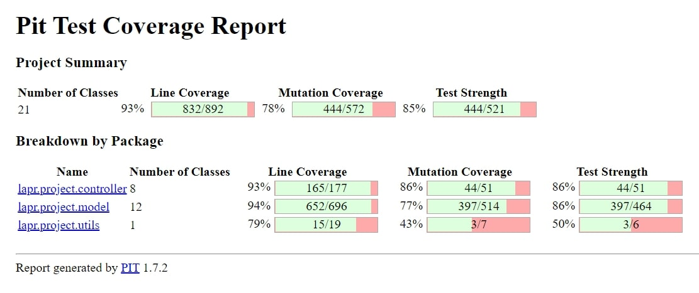
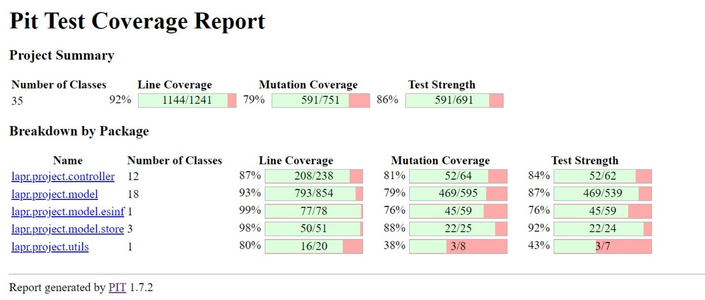
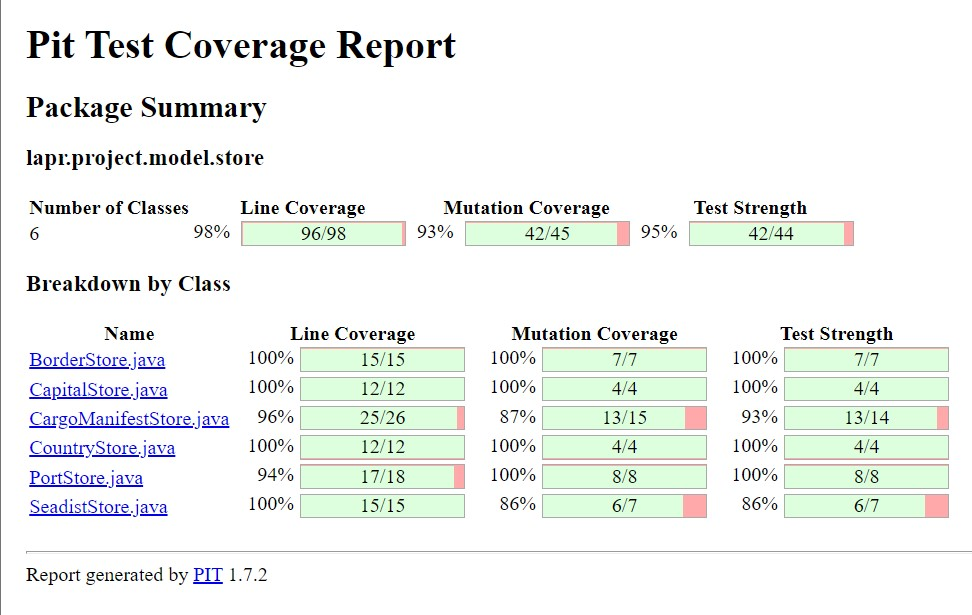
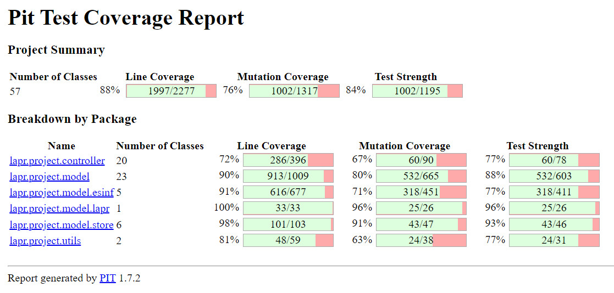

# LAPR3 - 2021/2022

-----------------------------


-----------------------------

#### Team Macchiato js _ Class DE:
* 1200720 _ Manuela Leite
* 1201239 _ Francisco Redol
* 1201382 _ Pedro Rocha
* 1201386 _ Rita Ariana Sobral
* 1171887 _ Duarte Paulo

#### Teachers/Advisors:
* Nuno Bettencourt (NMB)
* José Marinho (JSM)
* António Silva Pereira (AMP)
* Orlando Sousa (OMS)
* Carlos Augusto Ramos (CAR)

#### Client:
* Nuno Bettencourt (NMB)

#### Course Unit:
* Laboratório/Projeto LAPR3

-----------------------------
# Document division

This document is divided in different categories, being them:

1. Report
   1. Problem Statement
   2. Project Division Organization
   3. Solution
   4. Software Engineering
      1. Use Case Diagram
      2. Domain Model
      3. Class Diagram (CD) for the whole project.
      4. For each US:
         1. Requirements Engineering:
            1. System Sequence Diagram (SSD).
         2. Engineering Analysis:
            1. Domain Model.
         3. Engineering Design
            1. Class Diagram (CD)
            2. Sequence Diagram (SD)
      5. Decision Making
      6. Complexity Analysis
   5. Coverage
      1. Project Coverage
      2. Pit Test Coverage Report
   6. Team Performance
2. README

-----------------------------

# Report

## Abstract

This project portraits everything the students learned during the semester and the results reflect the performance by each member of the team.

The project assignment presents the development of a software product for cargo shipping company to handle their logistics. This company operates through land and sea, across different
continents and has several warehouses spread along the world.

It was divided in 4 sprints to help us organize everything and each sprint had its own use cases.

## Introduction

This project has the goal to put into practice the good pratices learned on the differents course units: Applied Physics (FSIAP), Computer Architecture (ARQCP), Data
Structures (ESINF) and Databases (BDDAD), and Laboratory/Project III (LAPR3). An iterative and incremental process applies.

An agile methodology based on Scrum must be applied to manage each team’s work during each three-week sprint.

The main goal was to create a product that will be use to manage the logistics of a shipping company that operates across different continents through land and sea and the own several warehouses.

The software is developed in Java, and  some other software used for quick notifications should be developed in C/Assembly. The data should persist in a Database(SQL).


## Problem Statement
In response to LAPR3 Project Assignment, we had to develop a software for cargo shipping company to manage their logistics.
The company operates through land and sea, across different continents and has several warehouses spread along the world.
It should allow the Traffic Manager to import ships, see Ships's different data and create summary's.


##  Projet Division Organization
####  US101 - Francisco Redol
####  US102 - Pedro Rocha
####  US103 - Rita Ariana Sobral
####  US104 - Manuela Leite
####  US105 - Manuela Leite & Pedro Rocha
####  US106 - Rita Ariana Sobral & Francisco Redol
####  US107 - Manuela Leite, Francisco Redol, Pedro Rocha & Rita Ariana Sobral
####  US108 - Rita Ariana Sobral & Francisco Redol
####  US109 - Manuela Leite & Francisco Redol
####  US110 - Manuela Leite & Pedro Rocha
####  US111 - Manuela Leite, Francisco Redol, Pedro Rocha & Rita Ariana Sobral
####  US201 - Manuela Leite & Rita Ariana Sobral
####  US202 - Francisco Redol e Pedro Rocha
####  US203 - Manuela Leite, Francisco Redol, Pedro Rocha & Rita Ariana Sobral
####  US204 - Rita Ariana Sobral
####  US205 - Francisco Redol
####  US206 - Pedro Rocha
####  US207 - Manuela Leite
####  US208 - Francisco Redol & Manuela Leite
####  US209 - Pedro Rocha & Rita Ariana Sobral
####  US210 - Manuela Leite, Francisco Redol, Pedro Rocha & Rita Ariana Sobral
####  US301 - Rita Ariana Sobral & Francisco Redol
####  US302 - Manuela Leite
####  US303 - Rita Ariana Sobral & Pedro Rocha
####  US304 - Manuela Leite & Rita Ariana Sobral
####  US305 - Pedro Rocha & Francisco Redol
####  US306 - Manuela Leite & Pedro Rocha
####  US307 - Rita Ariana Sobral & Francisco Redol
####  US308 - Pedro Rocha & Francisco Redol
####  US309 - Pedro Rocha & Manuela Leite
####  US310 - Manuela Leite, Francisco Redol, Pedro Rocha & Rita Ariana Sobral
####  US311 - CANCELED
####  US312 - Rita Ariana Sobral
####  US313 - Manuela Leite
####  US314 - Pedro Rocha
####  US315 - Francisco Redol
####  US316 - Rita Ariana Sobral
####  US317 - Manuela Leite
####  US318 - Francisco Redol
####  US319 - Rita Ariana Sobral
####  US320 - Pedro Rocha

####  US401 - Manuela Leite e Pedro Rocha
####  US402 - Rita Ariana Sobral 
####  US403 - Francisco Redol e Duarte Paulo
####  US404 - Francisco Redol
####  US405 - Pedro Rocha 
####  US406 - Pedro Rocha e Rita Ariana Sobral
####  US407 - Manuela Leite e Francisco Redol
####  US408 - CANCELED
####  US409 - Francisco Redol 
####  US410 - Manuela Leite e Pedro Rocha
####  US411 - Duarte Paulo e Rita Ariana Sobral
####  US412 - Rita Ariana Sobral
####  US413 - Francisco Redol
####  US414 - Pedro Rocha
####  US415 - Manuela Leite
####  US416 - Manuela Leite, Francisco Redol, Pedro Rocha & Rita Ariana Sobral
####  US417 - Rita Ariana Sobral 
####  US418 - Francisco Redol
####  US419 - Manuela Leite
####  US420 - Pedro Rocha

## Solution

For LAPR3, the goal is to develop a software for a cargo shipping company to handle their logistics.

To reach this goal, we were instructed to adopt a Test-Driven-Development during the project, use Java, and follow an agile Scrum Methodology aswell as Jira.
We we're also required to apply the knowledge acquired in Information Structures and Database unit courses, in order to fully develop all the requested functionalities.

Jira was used to create issues and tasks, aswell as dividing them and planning each Sprint. Each user story was created and assigned to a team member(s), with focus on:
* Analysis, where it was developed the Use Case Diagram and the System Sequence Diagram.
* Design, where it was developed the Class Diagram, Sequence Diagram.
* Implementation, where code and test code were implemented.
* Review, where it was possible to review the entire implementation.

## Software Engineering

* [Use Case Diagram](https://bitbucket.org/lei-isep/lapr3-2021-g042/src/master/docs/UCD.svg)

* [Domain Model](https://bitbucket.org/lei-isep/lapr3-2021-g042/src/master/docs/DM.svg)

* [Class Diagram](https://bitbucket.org/lei-isep/lapr3-2021-g042/src/master/docs/CD.svg)


| **_US_**  | **_DESCRIPTION_** | **_ACCEPTANCE CRITERIA_**|                                       
|:---------------:|:--------------------:|:---------------------------|
| **[US101](https://bitbucket.org/lei-isep/lapr3-2021-g042/src/master/docs/US101/US101.md)** | **As a traffic manager, I which to import ships from a text file into a BST.** | No data lost.|
| **[US102](https://bitbucket.org/lei-isep/lapr3-2021-g042/src/master/docs/US102/US102.md)** | **As a traffic manager I which to search the details of a ship using any of its codes: MMSI, IMO or Call Sign.** | Correct use of OOP concepts.|
| **[US103](https://bitbucket.org/lei-isep/lapr3-2021-g042/src/master/docs/US103/US103.md)** | **As a traffic manager I which to have the positional messages temporally organized and associated with each of the ships** | Efficient access of any position value(s) of a ship on a period or date.|
| **[US104](https://bitbucket.org/lei-isep/lapr3-2021-g042/src/master/docs/US104/US104.md)** | **As a traffic manager I which to make a Summary of a ship's movements.** | For a given ship return in an appropriate structure one of its codes (MMSI, IMO or Call Sign), Vessel Name, Start Base Date Time, End Base Date Time, Total Movement Time, Total Number of Movements, Max SOG, Mean SOG, Max COG, Mean COG, Departure Latitude, Departure Longitude, Arrival Latitude, Arrival Longitude, Travelled Distance (incremental sum of the distance between each positioning message) and Delta Distance (linear distance between the coordinates of the first and last move).| 
| **[US105](https://bitbucket.org/lei-isep/lapr3-2021-g042/src/master/docs/US105/US105.md)** | **As a traffic manager I which to list for all ships the MMSI, the total number of movements, Travelled Distance and Delta Distance.** | ordered by Travelled Distance and total number of movements(descending/ascending).|
| **[US106](https://bitbucket.org/lei-isep/lapr3-2021-g042/src/master/docs/US106/US106.md)** | **Get the top-N ships with the most kilometres travelled and their average speed (MeanSOG).** | In a period (initial/final Base Date Time) grouped by Vessel Type.|
| **[US107](https://bitbucket.org/lei-isep/lapr3-2021-g042/src/master/docs/US107/US107.md)** | **Return pairs of ships with routes with close departure/arrival coordinates (no more than 5 Kms away) and with different Travelled Distance.** | Sorted by the MMSI code of the 1st ship and in descending order of the Travelled Distance difference. Do not consider ships with Travelled Distance less than 10 kms.|
| **[US108]()** | **As Project Manager, I want the team to develop the data model required to support all the functionality and to fulfill the purpose of the system to develop. This data model is to be designed following a systematic data modeling methodology.** | The result should include (1) the conceptual data model, (2) the logical data model according to the database technology to use, (3) the physical data model to be implemented at the selected DBMS, (4) a data dictionary describing the relevant details of the database elements and (5) a clear and concise justification supporting the selected database technology. It is possible to run a SQL script to create the database schema in a complete and consistent way without errors. The data models generated at each one of the three abstraction levels (conceptual, logical, and physical) map only the meaningful concepts and characteristics in compliance with the corresponding level. Each one of the data models respects the former one, i.e., the logical data model respects the conceptual data model, and the physical data model respects the logical data model. The conceptual data model is a valid view/representation of the UoD. The notation used for each one of the data models is adequate, consistent, and following the specification|
| **[US109]()** | **As Project Manager, I want the team to draft an SQL script to test whether the database verifies all the data integrity restrictions that are required to fulfil the purpose of the system and the business constraints of the UoD.** | There is a catalogue of data integrity restrictions grouped by type (Domain, Identity, Referential, Application) clearly stated. For each data integrity restriction in the catalogue there is a set of SQL instructions that verify the restriction.  All SQL instruction in the data integrity verification script are accompanied by a comment that describes the expected result (Pass or Fail; in the latter a justification is given).|
| **[US110]()** | **As Project Manager, I want the team to define the naming conventions to apply when defining identifiers or writing SQL or PL/SQL code. The naming conventions may evolve as new database and programming objects are known. The naming conventions guide should be organized in a way to facilitate its maintenance** | There are naming conventions clearly stated to create databases and database objects. The minimum set includes tables, attributes, constraints, primary and foreign keys. The naming conventions are available in a way that makes them easy to understand and complete in a continuous way |
| **[US111](https://bitbucket.org/lei-isep/lapr3-2021-g042/src/master/docs/US111/US111.md)** | **As Project Manager, I want the team to create a SQL script to load the database with a minimum set of data sufficient to carry out data integrity verification and functional testing. This script shall produce a bootstrap report providing the number of tuples/rows in each relation/table.** | The bootstrap SQL script runs and loads the database as expected with no errors, The bootstrap report is generated and correct, i.e., all tables are mentioned, and their cardinality is correct. |
| **[US201](https://bitbucket.org/lei-isep/lapr3-2021-g042/src/master/docs/US201/US201.md)** | **As a Port manager, I which to import ports from a text file and create a 2D-tree with port locations.** | 2D-tree balanced. |
| **[US202](https://bitbucket.org/lei-isep/lapr3-2021-g042/src/master/docs/US202/US202.md)** | **As a Traffic manager, I which to find the closest port of a ship given its CallSign, on a certain DateTime.** | using 2D-tree to find closest port. |
| **[US203](https://bitbucket.org/lei-isep/lapr3-2021-g042/src/master/docs/US203/US203.md)** | **As Project Manager, I want the team to review the relational data model in view of the new user stories so it can support all the requirements to fulfil the purpose of the system being developed.** | The following deliverables are expected: (1) revised relational data model in 3NF, (2) revised SQL script to create the database schema in Oracle (physical data model) and (3) database bootstrap script. It is possible to run a SQL script to create the database schema in a complete and consistent way without errors. It is possible to run a script to load the database with enough data to explore the database and run the user stories (database bootstrap script). |
| **[US204](https://bitbucket.org/lei-isep/lapr3-2021-g042/src/master/docs/US204/US204.md)** | **As Client, I want to know the current situation of a specific container being used to transport my goods.** | Clients provide the container identifier and get the type and the concrete instance of its current location, e.g., PORT, Leixões or SHIP, WeFly.|
| **[US205](https://bitbucket.org/lei-isep/lapr3-2021-g042/src/master/docs/US205/US205.md)** | **As Ship Captain, I want the list of containers to be offloaded in the next port, including container identifier, type, position, and load.** | “next port” is properly identified. The containers being offloaded are properly identified. Output is in accordance with the specification wrt the information about each container. |
| **[US206](https://bitbucket.org/lei-isep/lapr3-2021-g042/src/master/docs/US206/US206.md)** | **As Ship Captain, I want the list of containers to be loaded in the next port, including container identifier, type, and load.** | “next port” is properly identified. The containers being loaded are properly identified. Output is in accordance with the specification wrt the information about each container. |
| **[US207](https://bitbucket.org/lei-isep/lapr3-2021-g042/src/master/docs/US207/US207.md)** | **As Ship Captain, I want to know how many cargo manifests I have transported during a given year and the average number of containers per manifest.** | Only the cargo manifests of the specified year are considered. Average containers per cargo manifest are properly computed. |
| **[US208](https://bitbucket.org/lei-isep/lapr3-2021-g042/src/master/docs/US208/US208.md)** | **As Ship Captain, I want to know the occupancy rate (percentage) of a given ship for a given cargo manifest. Occupancy rate is the ratio between total number of containers in the ship coming from a given manifest and the total capacity of the ship, i.e., the maximum number of containers the ship can load.** | Ship and cargo manifest are correctly identified. Occupancy rate is properly computed.|
| **[US209](https://bitbucket.org/lei-isep/lapr3-2021-g042/src/master/docs/US209/US209.md)** | **As Ship Captain, I want to know the occupancy rate of a given ship at a given moment.** | Ship is properly identified. Reuses US208. Occupancy rate is properly computed |
| **[US210](https://bitbucket.org/lei-isep/lapr3-2021-g042/src/master/docs/US210/US210.md)** | **As Traffic manager, I need to know which ships will be available on Monday next week and their location.** | Monday next week is properly identified. Only available ships are returned. All available ships are returned.|
| **[US301](https://bitbucket.org/lei-isep/lapr3-2021-g042/src/master/docs/US301/US301.md)** | **As a Traffic manager, I which to import data from countries, ports, borders and seadists files from the database to build a freight network.**| The capital of a country has a direct connection with the capitals of the countries with which it borders. The ports of a country, besides. connecting with all the ports of the same country, the port closest to the capital of the country connects with it; and finally, each port of a country connects with the n closest ports of any other country. The calculation of distances in Kms between capitals, and ports and capitals must be done using the GPS coordinates. The graph must be implemented using the adjacency matrix representation and ensuring the indistinct manipulation of capitals and seaports.|
| **[US302](https://bitbucket.org/lei-isep/lapr3-2021-g042/src/master/docs/US302/US302.md)** | **As a Traffic manager I wish to colour the map using as few colours as possible.**| Neighbouring countries must not share the same colour. |
| **[US303](https://bitbucket.org/lei-isep/lapr3-2021-g042/src/master/docs/US303/US303.md)** | **As a Traffic manager I wish to know which places (cities or ports) are closest to all other places (closeness places).**| Return the n closeness locals by continent. The measure of proximity is calculated as the average of the shortest path length from the local to all other locals in the network. |
| **[US304](https://bitbucket.org/lei-isep/lapr3-2021-g042/src/master/docs/US304/US304.md)** | **As Ship Captain, I want to have access to audit trails for a given container of a given cargo manifest, that is, I want to have access to a list of all operations performed on a given container of a given manifest, in chronological order. For each operation I want to know: the user/login that performed it, the date and time the operation was performed, the type of operation (INSERT, UPDATE, DELETE), the container identifier and the cargo manifest identifier.**| There is a table for recording audit trails, i.e., record all write-operations involving containers of a cargo manifest. Proper mechanisms for recording write-operations involving containers of a cargo manifest are implemented (INSERT, UPDATE, DELETE). |
| **[US305](https://bitbucket.org/lei-isep/lapr3-2021-g042/src/master/docs/US305/US305.md)** | **As Client, I want to know the route of a specific container I am leasing.**| Users provide their registration code, the container identifier and get its path, from source to current location indicating time of arrival and departure at each location and mean of transport (ship or truck) between each pair of locations. When the provided identifier is not valid or, being valid, is not leased by the client, a warning is returned.
| **[US306](https://bitbucket.org/lei-isep/lapr3-2021-g042/src/master/docs/US306/US306.md)** | **As Port manager, I want to know the occupancy rate of each warehouse and an estimate of the containers leaving the warehouse during the next 30 days. **| For each warehouse the required output is available. The 30 days period is properly considered. |
| **[US307](https://bitbucket.org/lei-isep/lapr3-2021-g042/src/master/docs/US307/US307.md)** | **As Port manager, I intend to get a warning whenever I issue a cargo manifest destined for a warehouse whose available capacity is insufficient to accommodate the new manifest**| Destination warehouse is properly identified. Warehouse available capacity is properly computed. The warning is triggered when required.|
| **[US308](https://bitbucket.org/lei-isep/lapr3-2021-g042/src/master/docs/US308/US308.md)** | **As Traffic manager, I want to have a system that ensures that the number of containers in a manifest does not exceed the ship's available capacity.**| The destination ship is properly identified. Ship’s available capacity is properly computed. The warning is triggered when required. |
| **[US309](https://bitbucket.org/lei-isep/lapr3-2021-g042/src/master/docs/US309/US309.md)** | **As Traffic manager, I do not allow a cargo manifest for a particular ship to be registered in the system on a date when the ship is already occupied.**| The ship is properly identified. Ship’s availability is properly computed. A warning or an exception is triggered when required. |
| **[US310](https://bitbucket.org/lei-isep/lapr3-2021-g042/src/master/docs/US310/US310.md)** | **As Port manager, I intend to have a map of the occupation of the existing resources in the port during a given month.**| Occupation of resources is restricted to the month provided. The reported occupation respects actual port capacity. |
| **[US311]()** | **As Ship Captain, I want to provide a database access account, with login “crew” and password “bd7wd5aF”, which gives access exclusively to the information of the containers that are loaded on my ship. The information about each container to be made available is: identifier, type, position and load.**| The user account is created. Only the required permissions are granted. Only the containers loaded at the Captain’s ship are available for consultation. Only the described data is publicly available through this “crew” account. |
| **[US312](https://bitbucket.org/lei-isep/lapr3-2021-g042/src/master/docs/US312/US312.md)** | **As Client, I want to know the current situation of a specific container being used to transport my goods – US204.**| When the provided identifier is not valid or, being valid, is not leased by the client, a warning is returned. This warning has two elements, the error code and the identifier of the container. The error code will be: 10 – invalid container id or 11 – container is not leased by client. |
| **[US313](https://bitbucket.org/lei-isep/lapr3-2021-g042/src/master/docs/US313/US313.md)** | **As a Port staff, given a Cargo Manifest, I wish to fill a statically reserved matrix in memory with each container's ID in its respective place.**| The matrix should be statically reserved in C, considering the maximum capacity of the ship, with all positions set to zero. The function should be developed in C. |
| **[US314](https://bitbucket.org/lei-isep/lapr3-2021-g042/src/master/docs/US314/US314.md)** | **As a Port staff, I wish to know the total number of free/occupied slots in the transport vehicle.**| The number of free/occupied slots should be determined by an Assembly function that traverses the matrix filled with the container's IDs. The function should return an eight-byte value, where the number of free slots is placed in the four most significant bytes and the number of occupied slots in the four least significant bytes. |
| **[US315](https://bitbucket.org/lei-isep/lapr3-2021-g042/src/master/docs/US315/US315.md)** | **As a Port staff, given a position in the transport vehicle, I wish to know if a container is there or not.**| The free/occupied position should be determined by an Assembly function that verifies the matrix filled with the containers’ IDs. The function should return 1 if a container is there or 0, otherwise. |
| **[US316](https://bitbucket.org/lei-isep/lapr3-2021-g042/src/master/docs/US316/US316.md)** | **As a Port staff, given a set of positions, I wish to know the total number of occupied slots.**| Using the Assembly function developed in the previous US, develop another Assembly function that traverses an array of positions and determines the total number of occupied slots. |
| **[US317](https://bitbucket.org/lei-isep/lapr3-2021-g042/src/master/docs/US317/US317.md)** | **As Ship Chief Electrical Engineer I want to know what set of materials to use in a container, to operate at temperatures of 7°C**| What types of materials should I use to make up the outer walls. What kind of materials should I use for the middle layers. What types of materials should I use for the interior walls. |
| **[US318](https://bitbucket.org/lei-isep/lapr3-2021-g042/src/master/docs/US318/US318.md)** | **As Ship Chief Electrical Engineer I want to know what set of materials to use in a container, to operate at temperatures of -5 °C**| What types of materials should I use to make up the outer walls. What kind of materials should I use for the middle layers. What types of materials should I use for the interior walls.|
| **[US319](https://bitbucket.org/lei-isep/lapr3-2021-g042/src/master/docs/US319/US319.md)** | **As Ship Chief Electrical Engineer I want to know the thermal resistance, for each operating temperature, of each container that must contain at least three different materials in its walls. One for the outer wall, one for the intermediate material, and one for the inner wall.**| For each container, working at a temperature of 7ºC, determine the thermal resistance it offers, according to the choice of materials made. For each container working at a temperature of -5ºC, determine the thermal resistance it offers according to the choice of materials. |
| **[US320](https://bitbucket.org/lei-isep/lapr3-2021-g042/src/master/docs/US320/US320.md)** | **As Ship Chief Electrical Engineer I intend to present in a summary document, the choice of materials considered for the two types of containers considered, and their thermal resistances.**| Present in a document (summary)(pdf), the choices considered for each type of container, as well as the respective thermal resistances.|
| **[US401](https://bitbucket.org/lei-isep/lapr3-2021-g042/src/master/docs/US401/US401.md)** | **As a Traffic manager I wish to know which ports are more critical (have greater centrality) in this freight network.** | Return the n ports with greater centrality. The centrality of a port is defined by the number of shortest paths that pass through it. |
| **[US402](https://bitbucket.org/lei-isep/lapr3-2021-g042/src/master/docs/US402/US402.md)** | **As a Traffic manager I wish to know the shortest path between two locals (city and/or port).** | Land path (only includes land routes, may start/end in port/city). Maritime path (only includes ports). Land or sea path (may include cities and ports). Obligatorily passing through n indicated places. |
| **[US403](https://bitbucket.org/lei-isep/lapr3-2021-g042/src/master/docs/US403/US403.md)** | **As a Traffic manager I wish to know the most efficient circuit that starts from a source location and visits the greatest number of other locations once, returning to the starting location and with the shortest total distance** | Implement one of the heuristics used for this type of circuit. |
| **[US404](https://bitbucket.org/lei-isep/lapr3-2021-g042/src/master/docs/US404/US404.md)** | **As Fleet Manager, I want to know the number of days each ship has been idle since the beginning of the current year.** | Current year is properly identified. Idle time is correctly computed per ship. Ships with no idle time are also reported. |
| **[US405](https://bitbucket.org/lei-isep/lapr3-2021-g042/src/master/docs/US405/US405.md)** | **As Fleet Manager, I want to know the average occupancy rate per manifest of a given ship during a given period.** | Ship is properly identified and considered. Period is properly identified and considered. Average occupancy rate per manifest and ship is correctly computed. |
| **[US406](https://bitbucket.org/lei-isep/lapr3-2021-g042/src/master/docs/US406/US406.md)** | **As Fleet Manager, I want to know which ship voyages – place and date of origin and destination – had an occupancy rate below a certain threshold; by default, consider an occupancy rate threshold of 66%. Only the trips already concluded are to be considered.** | Reuses US405. Average occupancy rate is properly computed. Trips still ongoing are not considered for the occupancy rate calculations.  |
| **[US407](https://bitbucket.org/lei-isep/lapr3-2021-g042/src/master/docs/US407/US407.md)** | **As Port manager, I intend to generate, a week in advance, the loading and unloading map based on ships and trucks load manifests and corresponding travel plans, to anticipate the level of sufficient and necessary resources (loading and unloading staff, warehouse staff, ...).** | Week in advance is properly identified. Loading and unloading map is comprehensive. Loading and unloading map is clear with respect to the sufficient and necessary resources for loading and unloading tasks. |
| **[US408](https://bitbucket.org/lei-isep/lapr3-2021-g042/src/master/docs/US408/US408.md)** | **As Port manager, I intend to develop a data model to build a Data Warehouse to analyse the volume of maritime traffic between any two ports. The fact to be analysed is the traffic volume measured by the indicators “number of containers”, “accumulated number of containers” and “target number of containers”. These indicators refer to the number of containers that are in transit between two ports/locations on the first day of each month. The dimensions to consider are Time, Port of origin and Port of destination. The Time dimension has a hierarchy with the following levels: Year, Month. The location/Port is subject to the following hierarchy: Continent, Country, Port. An estimate of the upper cardinality of the dimension and fact tables must be indicated.** | Fact tables are properly identified and described. Dimension tables are properly identified and described. The star/snowflake model is consistent with the purpose of the specified data warehouse app as well as the fact and dimension tables previously identified. The estimate of the cardinalities is coherent with the data model and properly justified. A SQL script to load and query the data warehouse to support a proof of concept is available and runs with no errors.|
| **[US409](https://bitbucket.org/lei-isep/lapr3-2021-g042/src/master/docs/US409/US409.md)** | **As a Port staff given a Cargo Manifest, I wish to fill a dynamically reserved array in memory with all the container's information in its respective place.** | The array should be dynamically reserved in C, adjusting the size of the array to the amount of handled data. All the details of a container can be present in more than one file. As such, define a struct that represents a container. Therefore, in the end, you should have a matrix of structs. The data types chosen for each field of the struct should be adjusted to the types of values they store. Memory usage should be kept to the minimum required. Also consider the order of fields that minimizes memory consumption. The function should be developed in C. |
| **[US410](https://bitbucket.org/lei-isep/lapr3-2021-g042/src/master/docs/US410/US410.md)** | **As a Ship Chief Electrical Engineer, given the position of a container, I want to know the amount of needed energy to keep the container at its required temperature.** | Develop an Assembly function, that given a position of a container, determines if that container is refrigerated or not, considering the information stored in the array of containers. The function should return 1 if a container is refrigerated or 0, otherwise. Develop a C function that, using the previous function developed in Assembly to know if a container is refrigerated, determines the amount of needed energy to keep the container at its required temperature.|
| **[US411](https://bitbucket.org/lei-isep/lapr3-2021-g042/src/master/docs/US411/US412.md)** | **As a Ship Chief Electrical Engineer, I want to receive an alert when the current energy generation units are not enough to provide energy to all refrigerated containers at once** | The needed calculations should be done in C. |
| **[US412](https://bitbucket.org/lei-isep/lapr3-2021-g042/src/master/docs/US412/US412.md)** | **As Ship Chief Electrical Engineer, we intend to know how much energy to supply, for each container, in a determined trip, with an exterior temperature of 20 ºC, and a travel time of 2h30.** | The total energy to be delivered to a container with an operating temperature of 7 °C. The total energy to be delivered to a container with an operating temperature of - 5 °C. |
| **[US413](https://bitbucket.org/lei-isep/lapr3-2021-g042/src/master/docs/US413/US413.md)** | **As Ship Chief Electrical Engineer, the objective is to know the total energy to be supplied to the set of containers in a certain established trip, assuming that all the containers have the same behaviour.** | Know the journey time. Know the temperature of the trip, or sections of the trip. Determine the total energy to be supplied to the set of containers with an operating temperature of 7 °C. Determine the total energy to be supplied to the set of containers with an operating temperature of - 5 °C.  |
| **[US414](https://bitbucket.org/lei-isep/lapr3-2021-g042/src/master/docs/US414/US414.md)** | **As Ship Chief Electrical Engineer, you want to know how much energy to supply to the container cargo, in a voyage (or route), depending on the position of the containers on the ship. Admitting that the interior containers, or the sides not exposed directly to the "sun", maintain the initial temperature, or of departure. However, the exposed sides may present temperature variations during the trip.** | Know the journey time. Know the temperatures of the travel sections. Know how many sides of each container are subject to temperature variation. Determine the energy required for one trip of the containers at a temperature of 7 ºC, depending on their position in the load. Determine the energy required for one trip of the containers at a temperature of -5 ºC, depending on their position in the cargo. |
| **[US415](https://bitbucket.org/lei-isep/lapr3-2021-g042/src/master/docs/US415/US415.md)** | **As the ship's captain I need to know how many auxiliary power equipment are needed for the voyage, knowing that each one supplies a maximum of 75 KW.** | Know the amount of energy required per type of container for a trip. Determine the total energy required to load containers on a given voyage (or route) as a function of their position in the load. Determine how many generators of the stated power are required for the trip. |
| **[US416](https://bitbucket.org/lei-isep/lapr3-2021-g042/src/master/docs/US416/US416.md)** | **As ship's master I intend to submit a summary document, with the following items.** | Present in a document (summary)(pdf), the necessary energy of each container, of each type (internal temperatures), with an external temperature of 20 ºC, and a travel time of 2h30. Present in a summary document, pdf, the total energy to supply, to the set of containers, in a established trip, assuming that all containers have the same behaviour. Present in a summary document, pdf, the energy to supply to the container load, in one trip (or route), as a function of the position of the containers on the vessel, and of the interior temperature of the two types of containers considered. Present in a summary document, pdf, the number of generators required for the voyage, or sectors of the trip.|
| **[US417](https://bitbucket.org/lei-isep/lapr3-2021-g042/src/master/docs/US417/US417.md)** | **As the Ship Captain I want the technical team to search for at least three types of ship/vessels that are better suited to the task (e.g., depending on the type of cargo), in which the “control” bridge can assume three positions, one in the bow, one in the stern, and finally in the midship.** | Search the different types of vessels for transporting different types of cargo. Containers, or solids in bulk. Identify the differentiating characteristics. |
| **[US418](https://bitbucket.org/lei-isep/lapr3-2021-g042/src/master/docs/US418/US418.md)** | **As the Ship Captain I want the determine the unladen center of mass for each vessel (if different) according to its characteristics. For calculation purposes, consider known geometric figures.** | Make a sketch of the vessel's geometric figure. Identify/choose a reference for the calculation. Determine the center of mass for the different vessels (consider that the vessel is all made of the same material). |
| **[US419](https://bitbucket.org/lei-isep/lapr3-2021-g042/src/master/docs/US419/US419.md)** | **As the Ship Captain I want to know where to position, for example, one hundred (100) containers on the vessel, such that the center of mass remains at xx and yy, determined in the previous point.** | Identify the area/volume of a container and its center of mass. The distribution of the mass inside the container will be considered uniform. Make a sketch of the distribution and loading on the vessel. Calculate the center of mass of the sketch performed. |
| **[US420](https://bitbucket.org/lei-isep/lapr3-2021-g042/src/master/docs/US420/US420.md)** | **As the Ship Captain I want to know for a specific vessel, how much did the vessel sink, assuming that each container has half a ton of mass.** | Determine the total mass placed on the vessel and the pressure exerted by it on the water. Determine the difference in height that the vessel has suffered, above water level.  |


## Coverage - Pit Test Coverage Report
#### Sprint 1

#### Sprint 2

#### Sprint 3

#### Sprint 4 


## Team Performance
The group agrees that all members of the group contributed equally to the project, althought some focused more on other parts given the division of the project.

-----------------
# README

This is the repository template used for student repositories in LAPR Projets.

## Java source files

Java source and test files are located in folder src.

## Maven file

Pom.xml file controls the project build.

### Notes
In this file, DO NOT EDIT the following elements:

* groupID
* artifactID
* version
* properties

Beside, students can only add dependencies to the specified section of this file.

## Eclipse files

The following files are solely used by Eclipse IDE:

* .classpath
* .project

## IntelliJ Idea IDE files

The following folder is solely used by Intellij Idea IDE :

* .idea

# How was the .gitignore file generated?
.gitignore file was generated based on https://www.gitignore.io/ with the following keywords:

- Java
- Maven
- Eclipse
- NetBeans
- Intellij

# Who do I talk to?
In case you have any problem, please email Nuno Bettencourt (nmb@isep.ipp.pt).

# How do I use Maven?

## How to run unit tests?

Execute the "test" goals.

```shell
$ mvn test
```
## How to generate the javadoc for source code?

Execute the "javadoc:javadoc" goal.

```shell
$ mvn javadoc:javadoc
```
This generates the source code javadoc in folder "target/site/apidocs/index.html".

## How to generate the javadoc for test cases code?

Execute the "javadoc:test-javadoc" goal.

```shell
$ mvn javadoc:test-javadoc
```
This generates the test cases javadoc in folder "target/site/testapidocs/index.html".

## How to generate Jacoco's Code Coverage Report?

Execute the "jacoco:report" goal.

```shell
$ mvn test jacoco:report
```

This generates a jacoco code coverage report in folder "target/site/jacoco/index.html".

## How to generate PIT Mutation Code Coverage?

Execute the "org.pitest:pitest-maven:mutationCoverage" goal.

```shell
$ mvn test org.pitest:pitest-maven:mutationCoverage
```
This generates a PIT Mutation coverage report in folder "target/pit-reports/YYYYMMDDHHMI".

## How to combine different maven goals in one step?

You can combine different maven goals in the same command. For example, to locally run your project just like on jenkins, use:

```shell
$ mvn clean test jacoco:report org.pitest:pitest-maven:mutationCoverage
```
## How to perform a faster pit mutation analysis?

Do not clean build => remove "clean"

Reuse the previous report => add "-Dsonar.pitest.mode=reuseReport"

Use more threads to perform the analysis. The number is dependent on each computer CPU => add "-Dthreads=4"

Temporarily remove timestamps from reports.

Example:
```shell
$ mvn test jacoco:report org.pitest:pitest-maven:mutationCoverage -DhistoryInputFile=target/fasterPitMutationTesting-history.txt -DhistoryOutputFile=target/fasterPitMutationTesting-history.txt -Dsonar.pitest.mode=reuseReport -Dthreads=4 -DtimestampedReports=false
```
## Where do I configure my database connection?

Each group should configure their database connection on the file:
* src/main/resources/application.properties