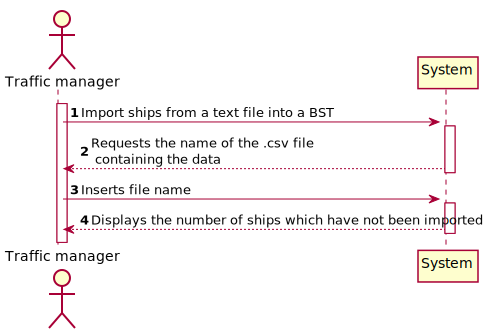
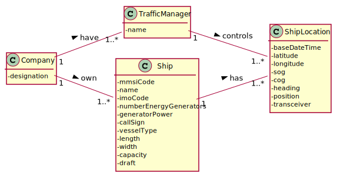
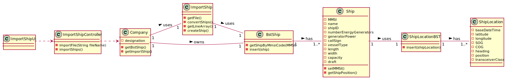
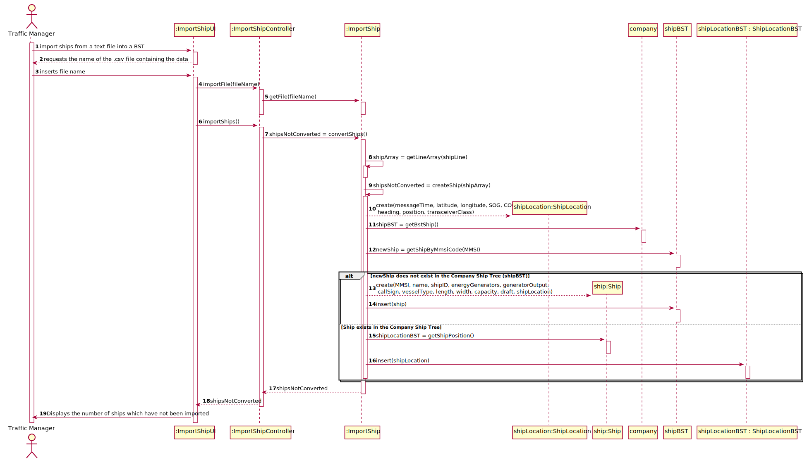

## US101 - As a traffic manager, I which to import ships from a text file into a BST.

## *Requirements Engineering*
#### SSD - System Sequence Diagram

#### DM - Domain Model

#### CD - Class Diagram

#### SD - Sequence Diagram

## *Decision Making*
BST & AVL – These are data storage and organization structures that benefit from less time complexity in carrying out operations such as reading, searching, insertion and removal.
The project statement allowed us to know in advance that the company we are developing software for would need to store a vast number of ships and their locations in a first phase, however, using information structures such as arrays and Arraylist, time performance of certain functions would be noticeably higher since these structures have a temporal complexity for the operations mentioned above.
Thus, to maximize the efficiency of the system's functionalities, we use binary trees.
The previously mentioned structures can be found in the storage of ships in the system as well as in the individual storage of each ship's positions.

## *Decision Making related*
#### Ship

* *MMSI:* According to the given Project Description, a Ship's MMSI code is characterized as a unique 9-digit ship identification code.
  So, to verify if the inserted MMSI complies with the defined regulations, it is checked first if the given code's string is null or if its length is different than 9.
  If so, an exception is thrown, and the object is not created since it does not meet the required criteria.

* *Name:* According to the given Project Description, a Ship's name does not have any length restriction.
  However, to verify if the inserted name does meet the specified regulations, it firstly checked if the string containing is neither null nor empty.
  If so, an exception is thrown, and the object is not created since it does not meet the criteria.

* *ShipID:* According to the given Project Description, a Ship's ID is a unique 7-digit international code.
  To verify the inserted the code, the setShipID method verifies if either the string is null, has a length different than 10 (since it includes the IMO characters) and if the first 3 chars equal "IMO".
  If so, an exception is thrown, and the object is not created since it does not meet the required criteria.

* *NumberGenerators* and *GeneratorOutput: * As a group, we thought that a ship could have 0 or more generators. However, we also agreed that we should not allow an object to be created with a generators number inferior to 0.

* *CallSign:* We verified if the string which possesses a ship's call sign was null or empty. If so, an exception is thrown so that the object is not created.

* *Cargo:* It is verified if the cargo string is null or empty. Then, if the string equals "NA", which means not available, the object's cargo is assigned as "NA". Otherwise, it is parsed and then, assigned to the object.

* *Length* and *Width:* Since a ship's dimensions are always bigger than 0, it is verified if both measurements comply with the specified criteria (dimensions>=0). If not, an IllegalArgumentException is thrown, and the objects creation shall not continue.

* *Draft:* Draft represents the distance between a ship's hull and the waterline. If it is lower than 0, it means the ship is out of water. So, if the received float which represents the draft is lower than 0, an exception is thrown.

#### ShipLocation

* *Latitude* and *Longitude:* According to the given Project Description, a ship's latitude and longitude should not be null nor empty. If the latitude equals 91 or longitude equals 181, respectively, those coordinates are set as "not available". Otherwise, if it exceeds the defined limits, an exception is thrown.

* *SOG:* If the shipLocation SOG is lower than 0, according to the project description rules, an exception is thrown.

* *COG:* If a COG is bigger or lower than 360 or 0, respectively, it is converted to the respective quadrant. If the inserted value is not valid, an exception is thrown.

* *Heading:* The Ship's heading could not be null nor empty. According to these rules and if it does not fit the [0,359] interval, an exception is thrown since the parameter does not comply with the rules.
  If the value equals "511", it is set as "not available" and if the passes all conditions, it is set as the ShipLocation object heading.

* *StartBaseDate:* Its assumed that the starting position of a trip will be the first element of the Iterable returned by the InOrder() method of BSTShipPositions, since the tree will be organized by the ShipLocation date

* *EndBaseDate:* Its assumed that the final position of a trip will be the last element of the Iterable returned by the InOrder() method of BSTShipPositions because the tree will be organized by the date of the ShipLocation

## *Complexity Analysis*
Concretely analysing the complexity of the algorithm related to US101 (convertShips())
using the measure of time (temporal complexity) we conclude that the algorithm has
polynomial complexity of degree 1 (O(n)).
The for loop is executed n times plus one(O(n+1)), this last time being the loop condition
checking (and failure), as readFile will read n lines from the input file. The remaining lines
are of O (1) complexity.