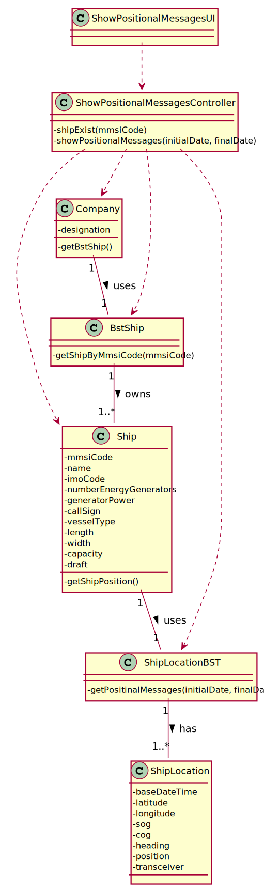

## US103 - As a traffic manager I which to have the positional messages temporally organized and associated with each of the ships

## *Requirements Engineering*
#### SSD - System Sequence Diagram

#### DM - Domain Model

#### CD - Class Diagram

#### SD - Sequence Diagram

## *Decision Making*
As the search, of the locations of a given ship, is required to be made between a period or between dates, 2 identical methods do the same thing, but for both situations. To search a range of dates, a recursive search was carried out between the range they define. When it was to search for a specific date, the BST find was used.

## *Complexity Analysis*
Concretely analysing the complexity of the algorithm related to US103
(showPositionalMessages(date)) using the measure of time (temporal complexity) we
conclude that the algorithm has logarithmic complexity (O(log2n)).
This method looks for an element in an AVL tree, balanced binary tree.
Concretely analysing the complexity of the algorithm related to US103
(showPositionalMessages(initial Date, final Date)) using the measure of time (temporal
complexity) we conclude that the algorithm has logarithmic complexity (O(log2n)).
This method looks for a set of elements in an AVL tree, binary balanced tree.
The US remains with complexity O(log2n).
