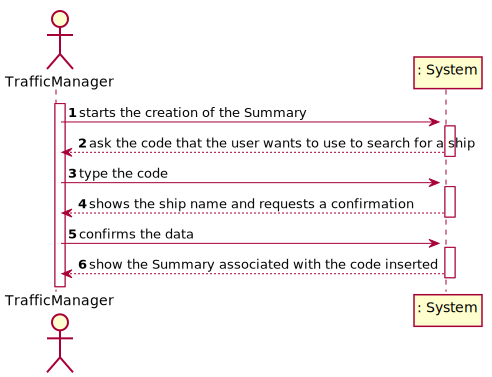
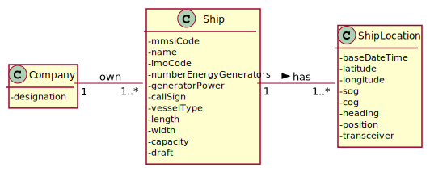
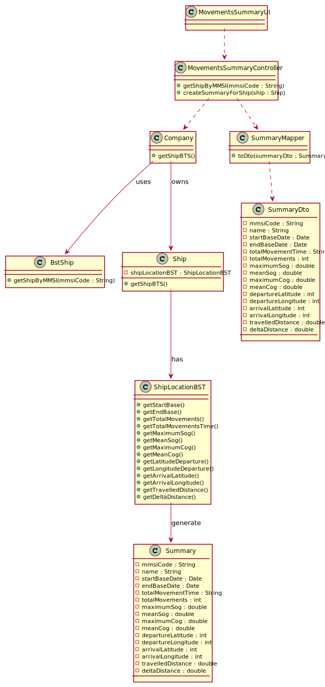
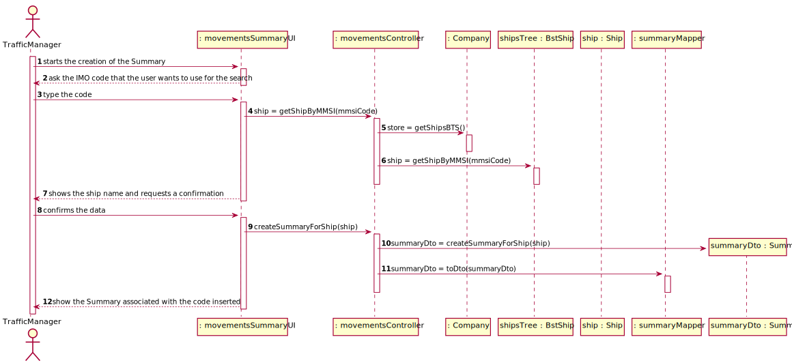

## US104 - As a traffic manager I which to make a Summary of a ship's movements.

## *Requirements Engineering*
#### SSD - System Sequence Diagram

#### DM - Domain Model

#### CD - Class Diagram

#### SD - Sequence Diagram

## *Decision Making*
In the calculation methods between two ship positions, the inOrder() method was used due to the need for ship locations to be in ascending order by their date so that the calculations could be performed correctly.

## *Complexity Analysis*
Concretely analysing the complexity of the algorithm related to US104
(createSummaryForShip()) using the measure of time (temporal complexity) we conclude
that the algorithm has constant complexity (O(1)). In this method, each line was evaluated
with O(1) complexity as only assignments are performed.