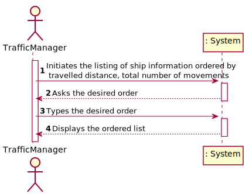
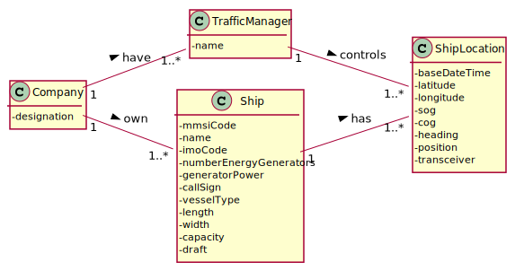
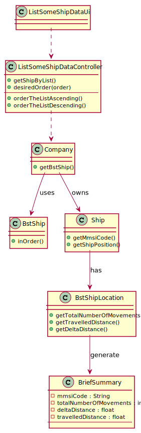
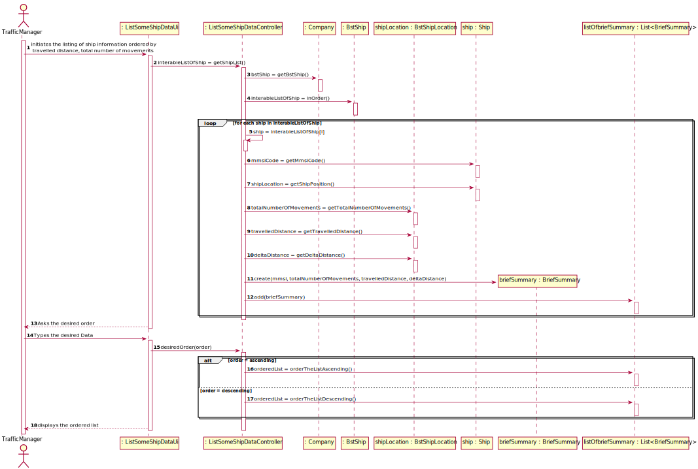

## US105 - As a traffic manager I which to list for all ships the MMSI, the total number of movements, Travelled Distance and Delta Distance
## *Requirements Engineering*
#### SSD - System Sequence Diagram

#### DM - Domain Model

#### CD - Class Diagram

#### SD - Sequence Diagram

## *Decision Making*
We chose to create a class that grouped the attributes necessary to satisfy the request in the US and to be able to implement the Interface comparator in this class for a better organization of the lists.

## *Complexity Analysis*
Concretely analysing the complexity of the algorithm related to US105
(organizeByDescendingOrder() or organizeByAscendingOrder()) using the measure of
time (temporal complexity) we conclude that the algorithm has polynomial complexity of
degree 1 (O(n)).
The for loop is executed n times plus one (O (n + 1)), this last time checking the condition
of the loop (and failing) and putting the requested boat information in an organized list.