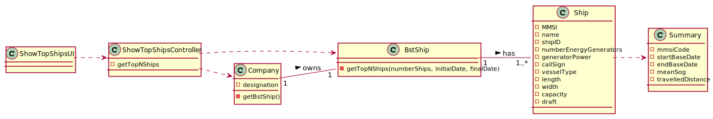

## US106 - Get the top-N ships with the most kilometres travelled and their average speed (MeanSOG).
## *Requirements Engineering*
#### SSD - System Sequence Diagram

#### DM - Domain Model

#### CD - Class Diagram

#### SD - Sequence Diagram

## *Decision Making*
To obtain/interpret the ships contained in the ship tree, an iterator is used.
This allows us to individually obtain all the ships contained in the tree.
However, as requested by US, it is still necessary to group them according to their Vessel Type code. For this purpose, a Hashmap with Vessel Type keys – integers - was used, whose values correspond to a summary list of the displacement of the various ships that share the same Vessel Type.
Thus, the set of values of this keyset present in the Hashmap will include summaries of all ships present in the binary tree.
Therefore, this premature organization will allow the easy ordering of the various summaries present in each list belonging to the values.

## *Complexity Analysis*
Concretely analysing the complexity of the algorithm related to US106 (getTopNShips())
using the measure of time (temporal complexity) we conclude that the algorithm has
polynomial complexity of degree 1 (O(n)).
The first for loop is executed n times plus one(O(n+1)), this last time being the loop
condition checking (and failure).
The second loop is still executed n more times, these being the outputs of the loop.