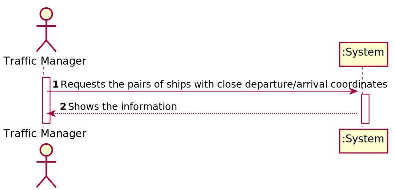
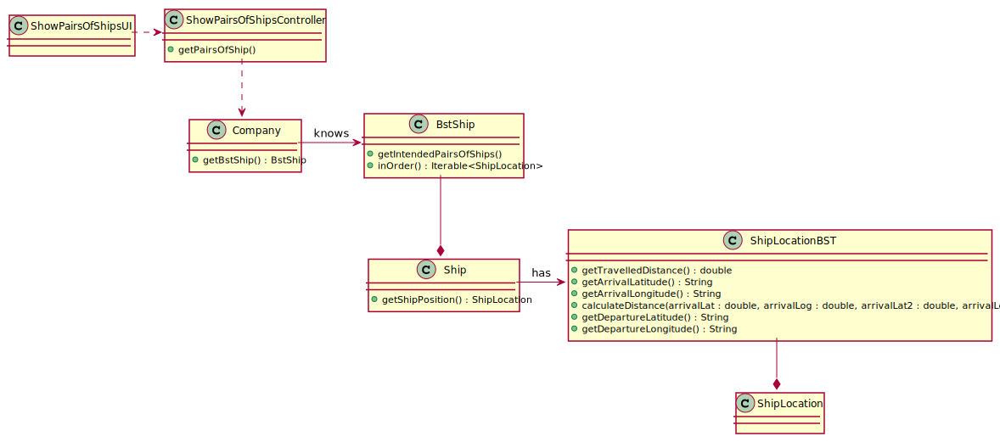
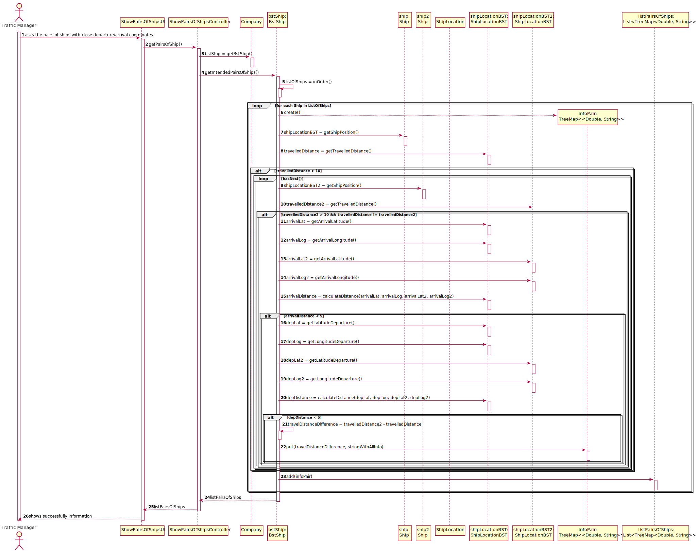

## US107 - Return pairs of ships with routes with close departure/arrival coordinates (no more than 5 Kms away) and with different Travelled Distance.
## *Requirements Engineering*
#### SSD - System Sequence Diagram

#### DM - Domain Model

#### CD - Class Diagram

#### SD - Sequence Diagram

## *Decision Making*
The information structure used to organize and store the requested ship objects in the US was a List that stores objects of type Treemap <Double, String>.
The Treemap organizes its objects by ascending criteria of the key, which in this case is the distance travelled, however, in the US it is requested in descending order, therefore, using Collection.reverseOrder().
As the ships are stored in a BST, by the inOrder() method, we obtain an ordered list of them, in ascending order. When comparing each ship with the following ones, and adding the comparison information that meets the requirements to the respective Treemap, in the end, the Treemap is added to the list, this is organized in ascending order of the MMSI of the first ship.

## *Complexity Analysis*
Concretely analysing the complexity of the algorithm related to US107
(getIntendedPairsOfShips ()) using the measure of time (temporal complexity) we
conclude that the algorithm has polynomial complexity of degree 2 (O(n2)).
The first for loop is executed n times plus one(O(n+1)), this last time being the loop
condition checking (and failure).
The second loop, in addition to the times already executed, is still executed n more times,
these being the outputs of the loop.