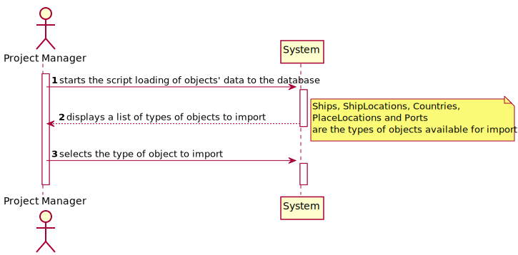
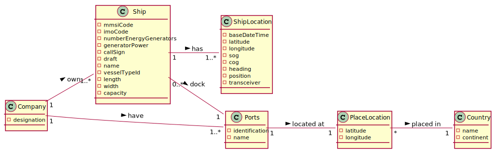
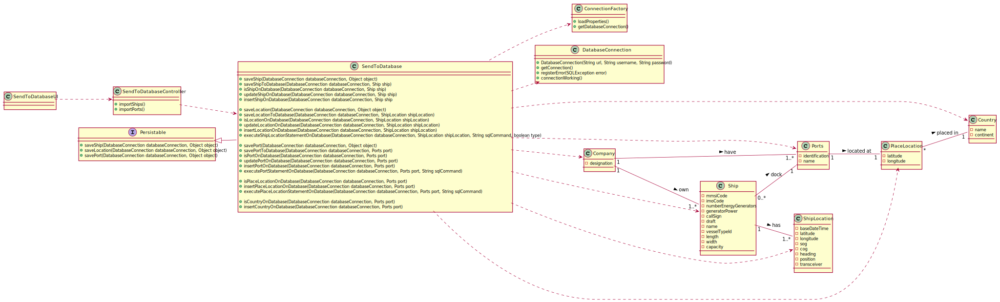
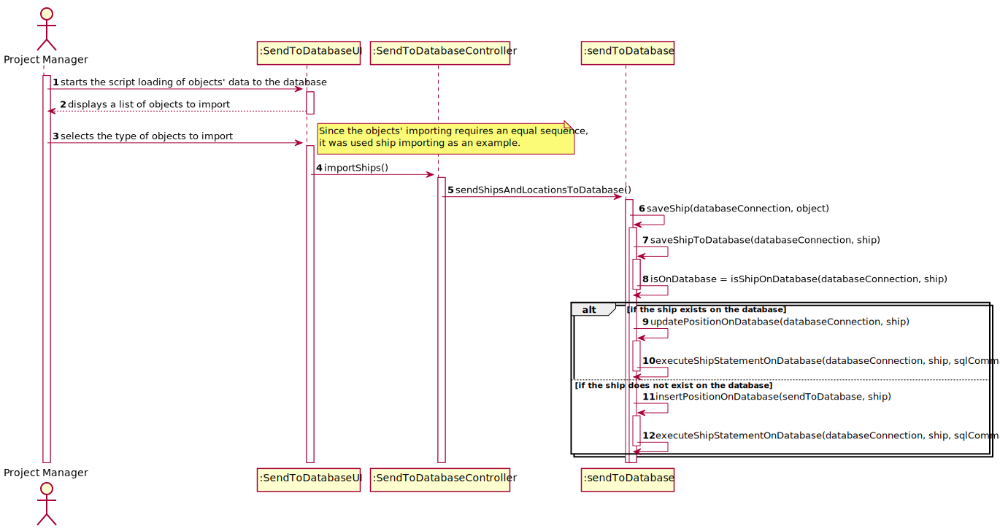

## US111 -  As Project Manager, I want the team to create a SQL script to load the databasewith a minimum set of data sufficient to carry out data integrity verification and functional testing.This script shall produce a bootstrap report providing the number of tuples/rowsin each relation/table.

## *Requirements Engineering*
#### SSD - System Sequence Diagram

#### DM - Domain Model

#### CD - Class Diagram

#### SD - Sequence Diagram

## *Decision Making*

During the develop of the US111, several choices were made to ensure the correct functioning of the code.

Thus, mainly DatabaseConnection , PreparedStatement, ResultSet objects were used.

In order to allow proper insertion of the data into the database, a sequence was planned to prevent errors related to the insertion and manipulation of data.

It was determined that functions that verify whether a particular row of data within a given table would first be invoked.

If this condition is true, the data for the same is updated. If not, this line will be fully inserted.

In order to modularize and allow the best handling, interpretation and maintenance of the code, these functions were divided into 4 main methods.

For example, in the case of a ship object. The saveShipToDatabase method coordinates the verification of the existence of a particular row, the updating of the line, and the insertion of a new one. This, thanks to the isShipOnDatabase, updateShipOnDatabase and insertShipOnDatabase methods, respectively.

For the objects, ShipLocation and Ports, the decided structure is similar.

However, to enter Ports, the PlaceLocation and Country objects must be inserted first into the database. The introduction sequence is similar and required in order to be able to carry out such an operation.