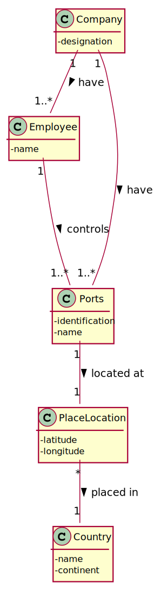
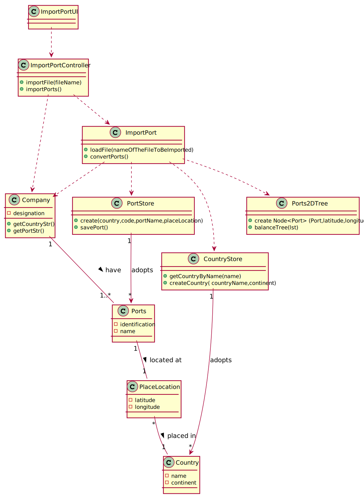

## US201 - As a Port manager, I which to import ports from a text file and create a 2D-tree with port locations.

## *Requirements Engineering*
#### SSD - System Sequence Diagram

#### DM - Domain Model

#### CD - Class Diagram

#### SD - Sequence Diagram

## *Decision Making*
KD trees are modified binary search trees (BST) that can perform searches in multiple dimensions and are a specific information storage and organization structure to efficiently represent data. 
Based on specific conditions, they allow you to organize information efficiently, which leads to less time complexity in carrying out operations such as reading, searching, insertion and removal.

The specific condition is an organization based on two fields, in the case of 2d-tree. 
As the storage of ports has an organization criterion based on its latitude and longitude, this information structure allows these objects to be registered in an orderly way so that it is possible to quickly and efficiently search for them by other user stories.

To balance the 2d-tree, we used a PortStore that stores all the ports and a respective 2d-tree with Nodes that store objects of the ports type and whenever a new ports file is imported, this one is responsible for creating a 2d-tree new one that contains the updated information and replace it with the old one. We chose this way because the way we found to efficiently balance the tree was already having all the information that is necessary to insert.

After the individual analysis of all user stories of this sprint, all restrictions regarding data input were met and it was decided that the latitude and longitude of the port should be governed by the restrictions that the latitude and longitude of a shipLocation has, since there are comparisons to be made with both values. 
Except for the part where if the latitude is equal to 91 or the longitude equal to 181 this would be inserted as “not available”.
## *Complexity Analysis*

Concretely analysing the complexity of the algorithm related to US201
(convertPorts()) using the measure of time (temporal complexity) we conclude that the algorithm has logarithmic complexity (O(n log2 n)).

The method is executed n times plus one(O(n+1)), this last time being the loop
condition checking (and failure).

The construction of the tree, as it uses a sorting algorithm to find the median at each level of the tree, has complexity O(n log2 n).

