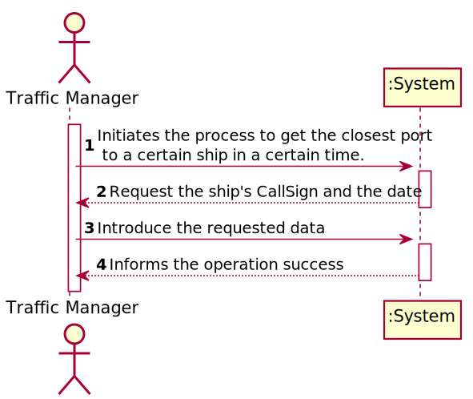
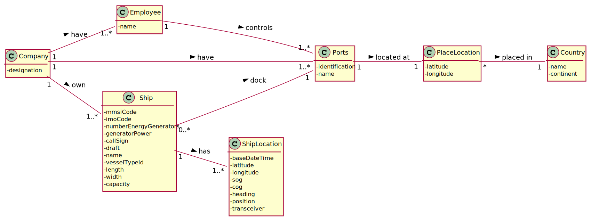
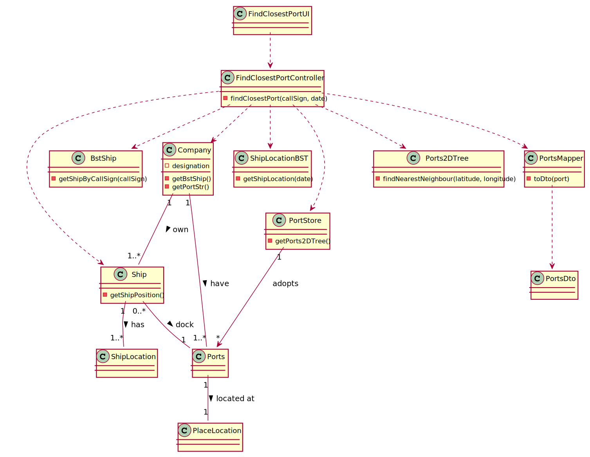
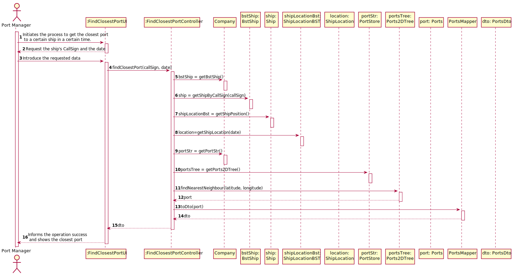

## US202 - As a Traffic manager, I which to find the closest port of a ship given its CallSign, on a certain DateTime.

## *Requirements Engineering*
#### SSD - System Sequence Diagram

#### DM - Domain Model

#### CD - Class Diagram

#### SD - Sequence Diagram

## *Decision Making*

Translating KDTree's qualities to our business context, one of its assets is, in a huge list of available ports, it is easy to find the closest port (through its latitude and longitude).

For this specific user story it was not necessary to make any specific decision, just define the output file format.

If there is no ship location of the ship on that specific date, the program returns null.

## *Complexity Analysis*

Concretely analysing the complexity of the algorithm related to US202
(findNearestNeighbour(latitude,longitude)) using the measure of time (temporal complexity) we
conclude that the algorithm has logarithmic complexity (O(log n)).

This method looks for one nearest neighbor in a balanced 2d tree and has a complexity of O (log n).
