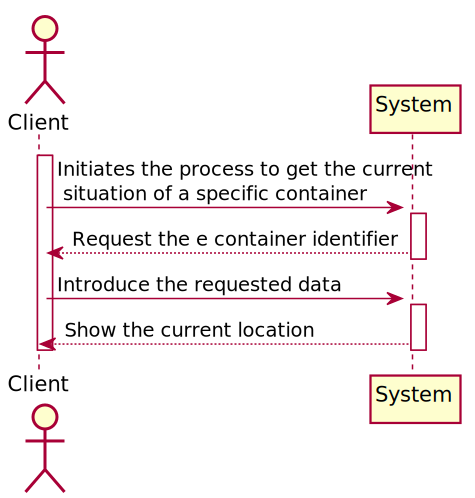
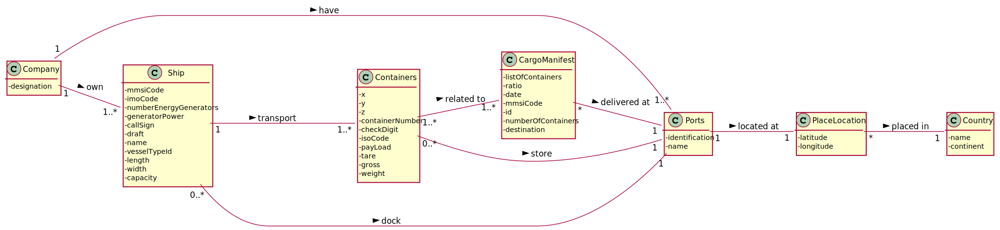
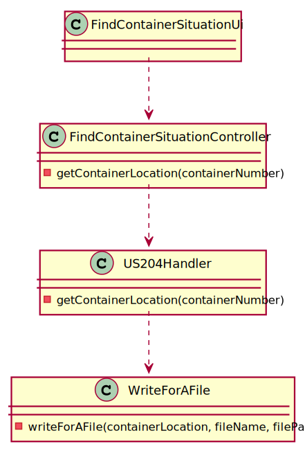
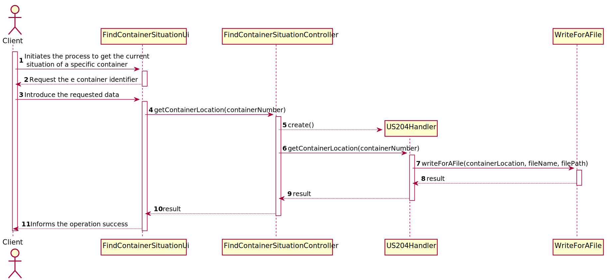

## US204 - As Client, I want to know the current situation of a specific container being used to transport my goods
## *Requirements Engineering*
#### SSD - System Sequence Diagram

#### DM - Domain Model

#### CD - Class Diagram

#### SD - Sequence Diagram

## *Decision Making*
The given report contained some ambiguity regarding the information about cargos manifests and containers, and so, after due analysis together, we created the extra classes that made sense to better fulfill the requested requirements.

The tables created were as follows:

Initially, it was decided to differentiate CargoManifestLoad and CargoManifestUnload due to the existence of different attributes.

The attributes that we found most important that the ManifestLoad job had were its Id, the mmsi of the boat that is transporting the containers, the id of the port from which the containers were loaded and the isConcluded flag. This is only considered completed when all phases have been completed. That is, when a CargoManifestUnload has been generated for each phase of CargoManifestLoad.

In turn, CargoManifestUnload has its Id, the Id of the phases that generated it, the Id of the destination port (where the containers were unloaded) and the Id of the associated CargoManifestLoad.

A phase represents one step out of several that a CargoManifestLoad has. The set of all ordered steps represents the ship's journey.

The phases have the Id of the CargoManifestLoad to which it belongs and its own Id. It also has an origin and destination, which is the name of the respective ports. An expected departure date, expected arrival date and an actual departure and arrival date.

Each pair of CargoManifest and Container knows the position the container is in on the boat, the Id of the container, the Id of CargoManifestLoad, the Id of CargoManifestUnload and the Id of the phase in which it was unloaded.
## *Script Analysis*

Primeiro, foi criado um cursor para iterar todo o CargoManifestContainer onde o atributo containerNumberId é igual ao container identifier dado pelo cliente para obtermos todos os id de cargoManifestLoad em que o contentor estava incluído.

Posteriormente, iteramos por todos os cargosManifestsLoadId, para obtermos caso exista o respetivo cargoManifestUnloadId.

Caso o respetivo cargoManifestUnloadId seja NULL quer dizer que o contentor está a ser transportado por um navio até ao respetivo porto, e como o contentor só pode estar a ser transportado por um barco de cada vez só pode existir um cargoManifestLoad nesta situação.

Para saber em que navio o contentor do cliente está a ser transportado obtemos o shipMmsiCode presente no cargoManifestLoad respetivo e com o shipMmsiCode conseguimos obter o nome do navio para informar o cliente.

Caso o contentor em questão esteja no navio a função termina a sua execução.

Caso não exista nenhum cargoManifestUnloadId a NULL é sinal que o container se encontra num porto. Posto isto temos que saber qual foi o último porto a que chegou, e sabemos isto com a realDataArrival que se encontra na classe phases.

Para obter a respetiva tabela phases e conseguir saber a realDataArrival e qual era o seu porto de destino recorro ao atributo phasesId de cargoManifestUnload.

Como vou comparando todos as datas e guardando a mais recente e o respetivo destino, no final do loop a variável v_locationName tem o nome do porto em que o contentor se encontra. 

