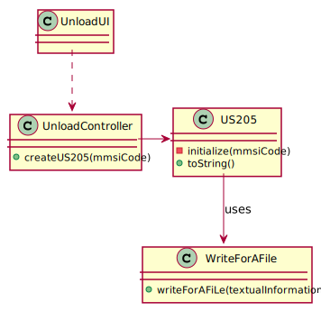
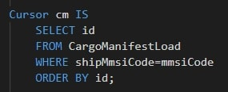
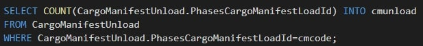

## US205 - As Ship Captain, I want the list of containers to be offloaded in the next port, including container identifier, type, position, and load.
## *Requirements Engineering*
#### SSD - System Sequence Diagram

#### DM - Domain Model

#### CD - Class Diagram

#### SD - Sequence Diagram

## *Script Analysis*

#### 1. O Script receberá por parâmetro o “mmsiCode”, isto é, o Código MMSI – identificador do navio e retornará uma String que conterá as informações desejadas sobre os respetivos navios a serem descarregados no “Next Port” e foram declaradas as variáveis demonstradas na figura seguinte.

#### 2. O Cursor será responsável por iterar os Cargo Manifests a carregar, ordenados crescentemente pelo id, para a sequência ser respeitada.

#### 3. Quando acabarem os Cargo Manifest, sairá do ciclo.

#### 4. É necessário obter a informação do número de fases que a rota terá, daí a execução do seguinte SELECT.

#### 5. É necessário obter a informação do número de Cargo Manifests Unload que a rota terá, daí a execução do seguinte SELECT.

#### 6. Se o número de fases corresponder com o número Cargo Manifests Unload, a “viagem” terminou.

#### 7. Para se determinar o “next port” procede-se à descoberta do destino da fase seguinte ao último Cargo Manifest Unload , isto é, o destino posterior ao "atual".

#### 8. Tendo em consideração que os ids estão ordenados crescentemente, o primeiro cargo Manifest que não está terminado é que dita a rota original do navio. Então, esse vai ser o porto a comparar nos restantes Cargo Manifests.

#### 9. Conhecida o “next port” a comparar, procede-se à listagem das informações referentes a cada contentor – id, posição (x, y, z), o tipo (isoCode) e à load (Weight), caso a comparação seja verdadeira.
