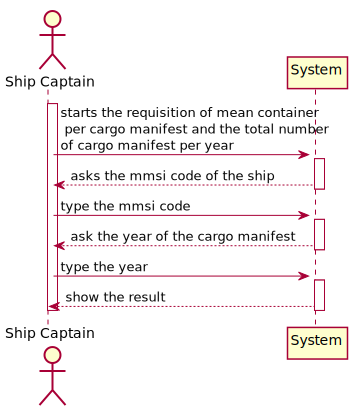
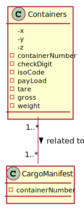
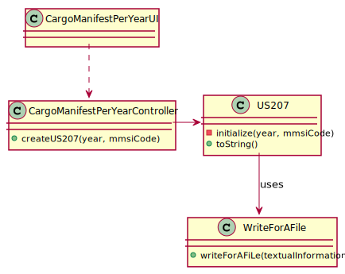
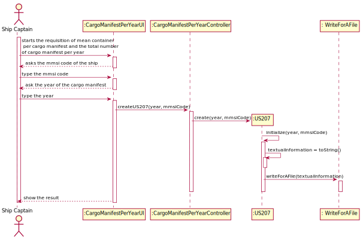

## US207 - As Ship Captain, I want to know how many cargo manifests I have transported during a given year and the average number of containers per manifest.

## *Requirements Engineering*
#### SSD - System Sequence Diagram

#### DM - Domain Model

#### CD - Class Diagram

#### SD - Sequence Diagram

## *Script Analysis*
First, we created a cursor to iterate all the Cargo ManifestLoad of a ship where the attribute isConcluded is equal to 1. The attribute IsConcluded to 1 means that the CargoManifestLoad has completed all its steps, whereas if the attribute is set to 0 it means that the CargoManifestLoad is incomplete. Later, we will iterate through all those CargoManifests that are completed, as each CargoManifestLoad is composed of phases the completion date of a CargoManifest will be recorded in its last phase. As a consequence of this, we will do a SELECT to find the last step of a CargoManifest, that is, find the maximum step of a CargoManifestLoad. After storing the maximum step inside the variable “maxPhase” we will look for the arrival date associated with this phase. Next, we will remove the year associated with this arrival date and compare it with the year entered by the user, if the years are the same, we will increment the “totalCargoManifests” variable so that at the end of the cycle we will obtain all cargoManifests completed in the year entered. Later for each CargoManifestLoad, we will see the associated Containers, and when we iterate over all cargoManifests and count the total associated Containers, we will divide the total number of Containers by the CargoMaifests to find the average number of containers per CargoManifest.