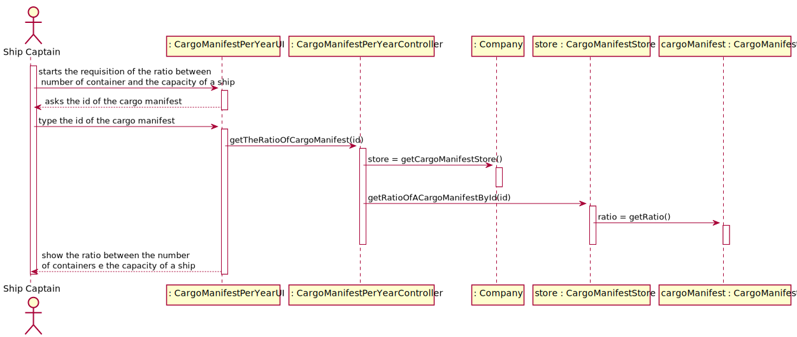
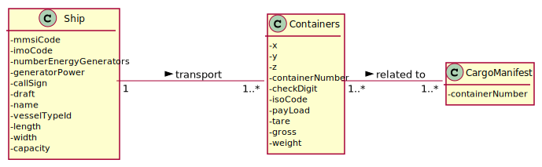
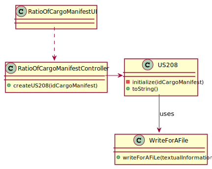
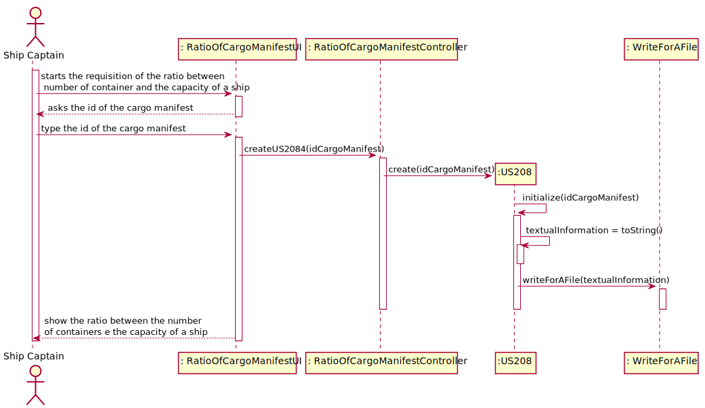

## US208 - As Ship Captain, I want to know the occupancy rate (percentage) of a given ship for a given cargo manifest. Occupancy rate is the ratio between total number of containers in the ship coming from a given manifest and the total capacity of the ship, i.e., the maximum number of containers the ship can load.

## *Requirements Engineering*
#### SSD - System Sequence Diagram

#### DM - Domain Model

#### CD - Class Diagram

#### SD - Sequence Diagram

## *Script Analysis*
We decided to receive the Id of a Cargo Manifest per parameter so that through this Id we can access all Containers associated with that Id. Later, through the Cargo Manifest in question, we will fetch the mmsi code of the ship associated with that Cargo Manifest and store it in the variable “shipMmsiCode” so that we can search in the Ship table for the ship that has the mmsi code equal to the variable “shipMmsiCode”. When the mmsi in the Ship table is found, we will go to that ship and get its capacity (the maximum number of containers a ship can carry) and store it in the “capacityShip” variable. Finally, we will divide the total containers into a Cargo Manifest by their capacity.