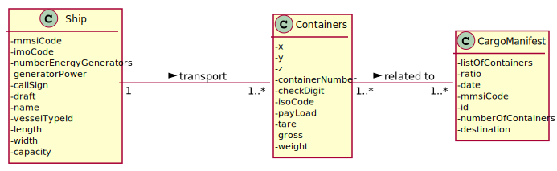

## US209 - As Ship Captain, I want to know the occupancy rate of a given ship at a given moment.

## *Requirements Engineering*
#### SSD - System Sequence Diagram

#### DM - Domain Model

#### CD - Class Diagram

#### SD - Sequence Diagram

## *Script Analysis*
First, we create a cursor to iterate all cargo manifests of a respective boat that is received by parameter and, in each iteration, we check if there is any PHASE in which the date is contained, checking if the date sent by parameter is contained within the departure and arrival date of each PHASE. If so, we count the containers in that particular PHASE, dividing the final value by the boat's capacity to obtain the percentage. The reasoning used to calculate the percentage was the same as in the US207, only changing when checking the date, which led to its non-direct use. 
