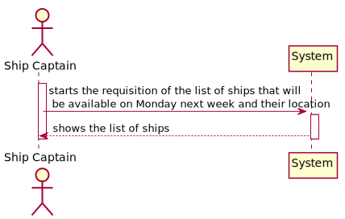
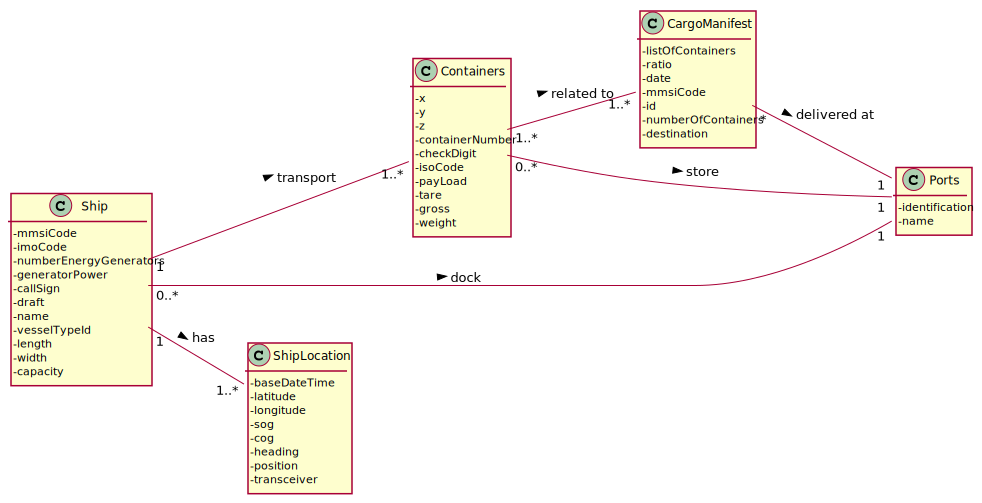
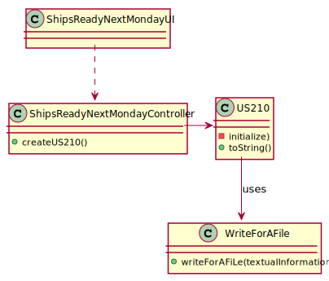
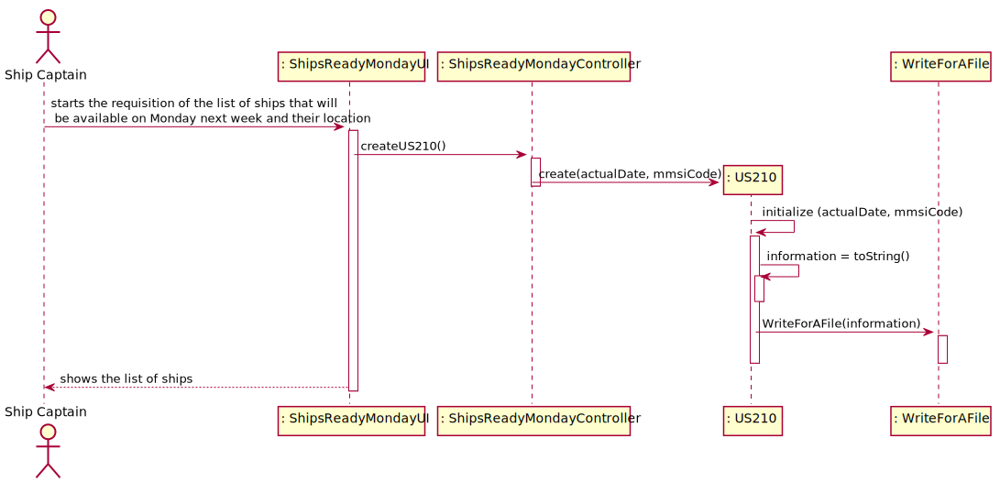

## US210 - As Traffic manager, I need to know which ships will be available on Monday next week and their location.
## *Requirements Engineering*
#### SSD - System Sequence Diagram

#### DM - Domain Model

#### CD - Class Diagram

#### SD - Sequence Diagram

## *Script Analysis*
As this user story asks to list all the ships that are available and their position, we first create a cursor to iterate all the ships and after that another cursor to iterate all the manifest positions of each iterated ship. After having the cursors created, using the NEXT_DAY function, we were able to find out which is the next Monday counting by the system date. Then, for each cargomanifest of each boat, we check if the expected date to finish its final PHASE is less than the date obtained by the NEXT_DAY function used previously. If all of the ship's manifest positions for that boat meet the aforementioned requirements, we will look for all of the boat's manifest positions for the one with the closest end date of next Monday and its respective position. If the boat has no associated manifest position, the user story will list the boat's most recent position.
