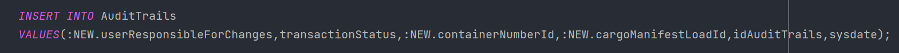

## US304 - As Ship Captain, I want to have access to audit trails for a given container of a given cargo manifest, that is, I want to have access to a list of all operations performed on a given container of a given manifest, in chronological order. For each operation I want to know: the user/login that performed it, the date and time the operation was performed,the type of operation (INSERT, UPDATE, DELETE), the container identifier and the cargo manifest identifier.
## *Requirements Engineering*
#### SSD - System Sequence Diagram

#### DM - Domain Model

#### CD - Class Diagram

#### SD - Sequence Diagram

## *Script Outputs Confirmation*
#### 1. Para satisfazer aos requisitos impostos pela US304, começamos por criar uma nova tabela chamada AuditTrails para armazenar as operações performanadas em um determinado Container 

#### 2. Após a criação desta tabela, tivemos também de adicionar um novo atributo no CargoManifestContainer para conseguirmos saber o utilizador responsável pela modificação no Contentor, o novo atributo chama-se "userResponsibleForChanges"

#### 3. Depois dessas alterações passamos a criação do trigger para conseguirmos monitorizar sempre que uma operação de "INSERT", "UPDATE" ou "DELETE" é performada em um Contentor

##### 3.1 O trigger começa por identificar o tipo de operação que foi realizada em um Contentor, o número 1 representa a operação de "INSERT", o número 2 a operação de "UPDATE" e a número 3 a operação de "DELETE"

##### 3.2 Após a identificação da realização realizada é inserido na tabela Audittrails as informações sobre a operação realizada em um determinado Contentor 

#### 4. Depois da implementação do Trigger, para sabermos a informação de um determinado Contentor foi feito uma função cujo o objetivo é simplesmente listar a informação de uma AuditTrails associado a um Contentor

## *Script Outputs Confirmation*

#### 1. O Contentor foi adicionado a base de dados por meio do Bootstrap, com esse evento o Trigger será ativado e registrará as seguintes informações sobre os Contentores inseridos: 

#### 2. Para efeito de teste usaremos o contentor com o id '456789423', e iremos alterar o seu atributo 'Gross', com esse evento novamente o Trigger será ativado e irá inserir a seguinte informação na tabela AuditTrails:

#### 3. Depois dessas operações realizadas, iremos chamar a função 'getInformationAboutAuditTrails' para nos mostrar as operações realizadas em um contentor de um determinado Cargo Manifest 

