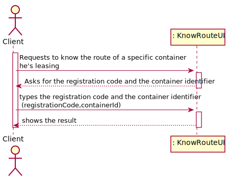
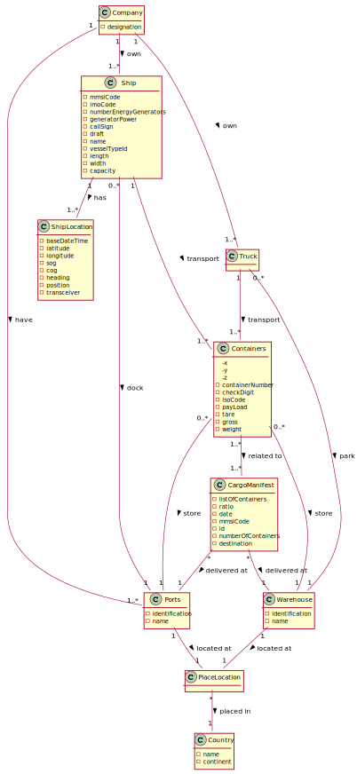
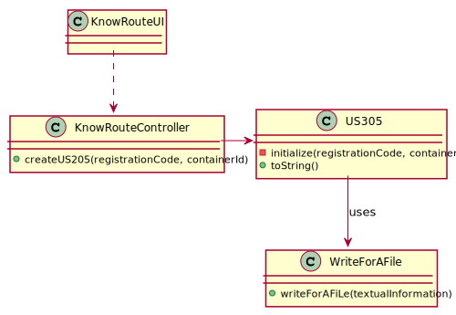
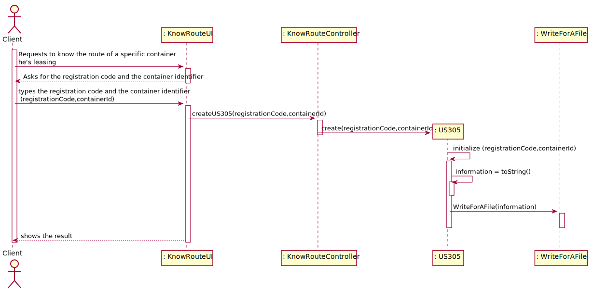
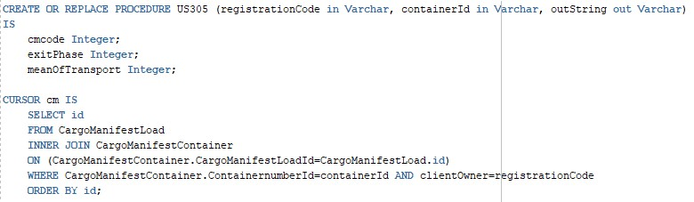
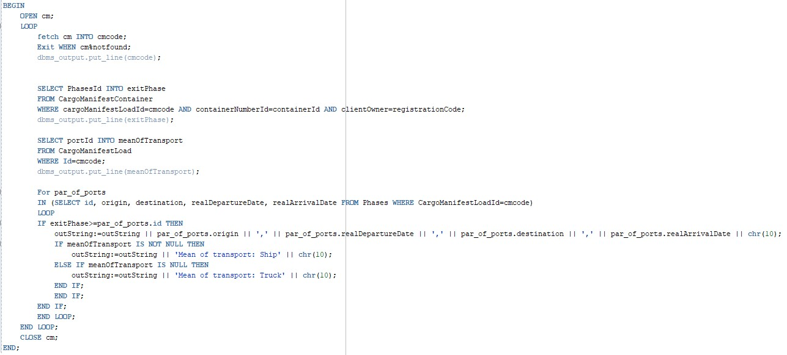
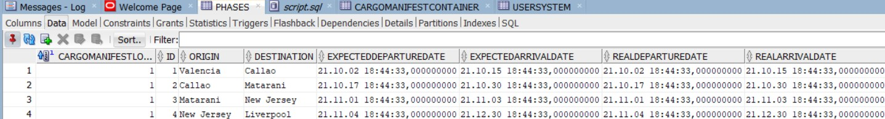
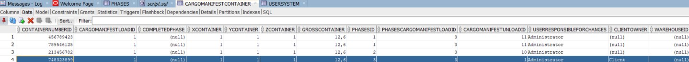
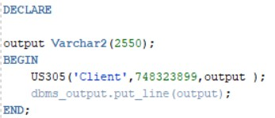
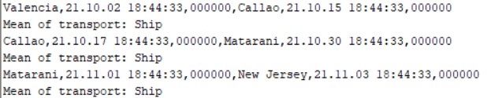

## US305 - As Client, I want to know the route of a specific container I am leasing.
## *Requirements Engineering*
#### SSD - System Sequence Diagram

#### DM - Domain Model

#### CD - Class Diagram

#### SD - Sequence Diagram

## *Script Analysis*
#### 1. O Script receberá por parâmetro o “containerId”, isto é, o identificador do contentor e o "registrationCode", o identificador do cliente. Retornará uma String que conterá as informações desejadas sobre o percurso do respetivo contentor. Foram declaradas as variáveis demonstradas na figura seguinte. O Cursor será responsável por iterar os Cargo Manifests Load cujo contentor está inserido.

#### 2. É necessário obter a informação da "fase atual" assim como o primeiro meio de transporte para dar início ao ciclo que irá trabalhar o percurso do contentor. Até se alcançar a "fase atual" procede-se à listagem das informações referentes a cada fase, ou seja, par de portos onde o contentor esteve - origem, destino, data de partida e de chegada.

## *Script Outputs Confirmation*
#### Para efeito de teste escolhemos o Contentor "748323899" com o dono "Client". Este contentor está presente no CargoManifestLoad 1  e sairá na phase 3. A última imagem demonstra o respetivo trajeto.
###### Phases

###### Cargo Manifest Container

###### Output

