## US306 - As Port manager, I want to know the occupancy rate of each warehouse and an estimate of the containers leaving the warehouse during the next 30 days.

## *Requirements Engineering*
#### SSD - System Sequence Diagram
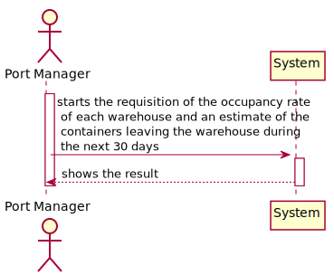
#### DM - Domain Model
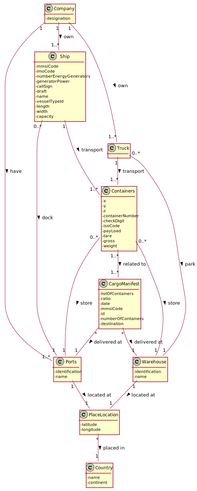
#### CD - Class Diagram
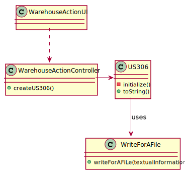
#### SD - Sequence Diagram
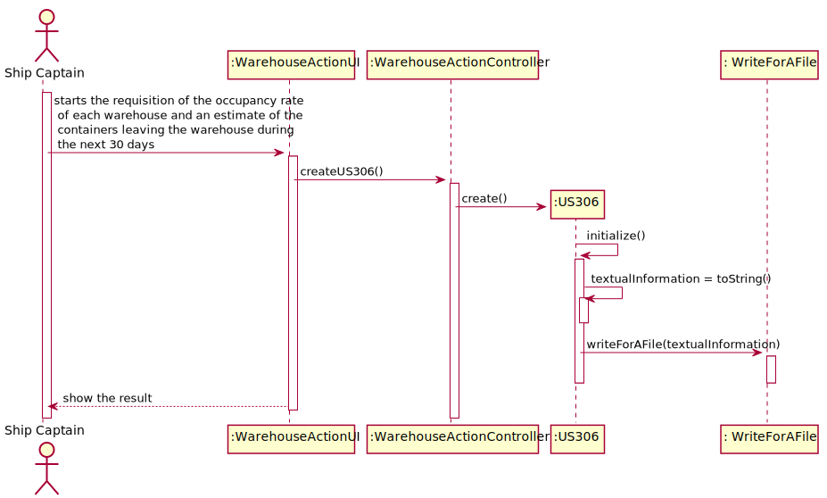

## *Script Analysis*

#### 1. Para atender os requisitos impostos pela US306, começamos por criar um Trigger responsável por calcular a ocupação de um Armazém sempre que um novo contentor é adicionado ou retirado de um armazém. Para isso, começamos por guardar na variável "destAux" o destino de um determinado contentor.
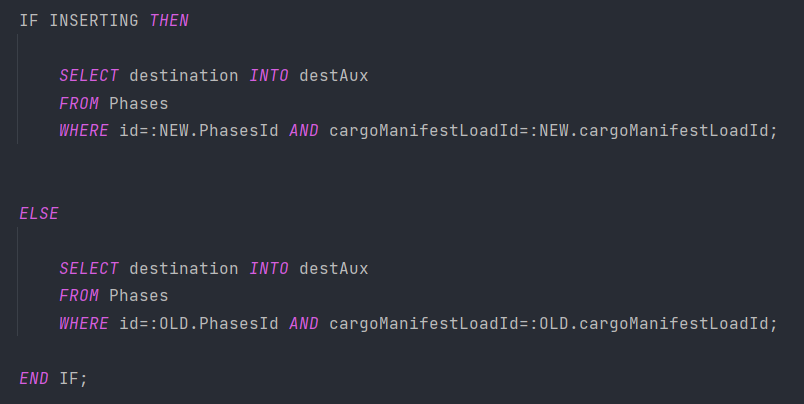

#### 2. Depois de guardarmos na variável "destAux" o destino do contentor temo de verificar se esse destino corresponde ao nome de um armazém pois, o destino de um contentor pode corresponder ao nome de um Porto ou de um armazém.
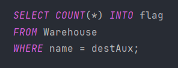

#### 3. Caso a variável corresponda ao nome de um armazém, iremos armazenar o ID desse armazém na variável "dest".
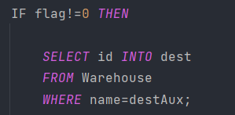

#### 4. Posteriormente, para cada Cargo Manifest Unload iremos buscar o Cargo Manifest Load ID  e a Phase Id associados e guardaremos nas variáveis "cmLoad" e "TripId". Posteriormente a isto, faremos um ciclo FOR para selecionar todos os CargoManifestContainer associados com o "cmLoad" e o "TripId" para que possamos achar o último Cargo Manifest associado a um contentor, caso seja o último  Cargo Manifest associado ao contentor então, contabilizaremos esse contentor para a ocupação do armazém a qual ele está associado. 
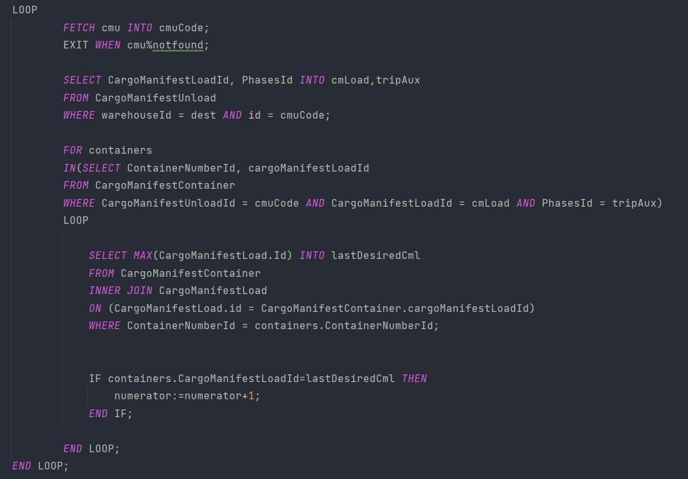

#### 5. Para além,  de contabilizar os contentores que já se encontram no armazém, optamos por também contabilizar os contentores que tem como destino e chegam em breve aquele armazém. 
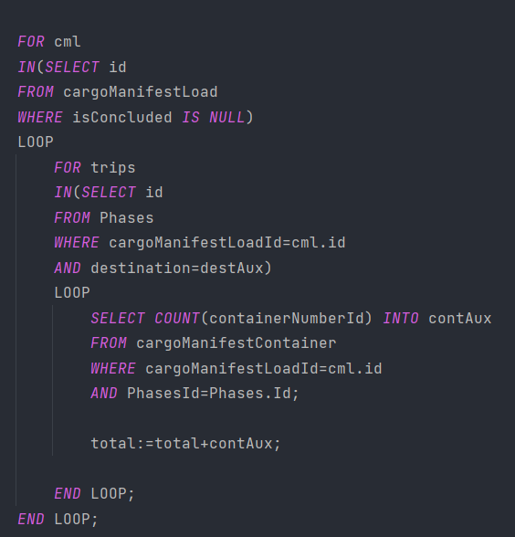

#### 6. Após contabilizarmos todos os contentores, iremos selecionar a capacidade da warehouse com o ID igual ao da variável "dest" e faremos o cálculo da ocupação e armazenaremos na variável "ocRate". Após a realização do cálculo faremos o UPDATE desse valor na warehouse em questão.
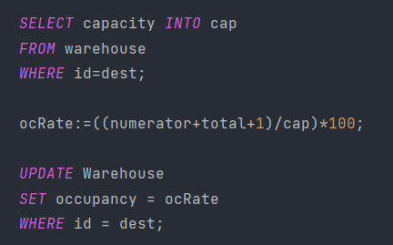

#### 7. Com o Trigger feito foi necessário criar um "PROCEDURE" para podermos listar a ocupação de todas os armazéns e os contentores que sairão nos próximos 30 dias.
##### 7.1 Utilizamos um "CURSOR" para armazenar o nome de todos os armazéns para que posteriormente fossemos buscar a ocupação de cada armázem.
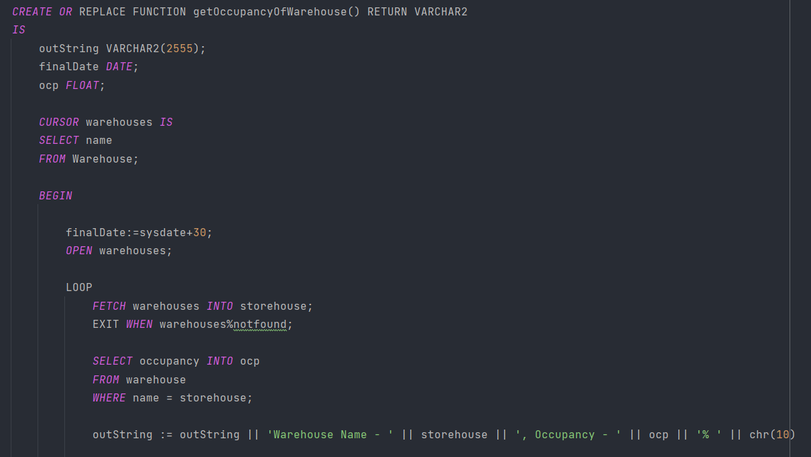

##### 7.2 Com este mesmo "CURSOR" fomos buscar todos as fases de um Cargo Manifest associadas a um contentor em um determinado armazém e verificar se a data de partida dessa fase encontra-se dentro do intervalo dos próximos 30 dias.
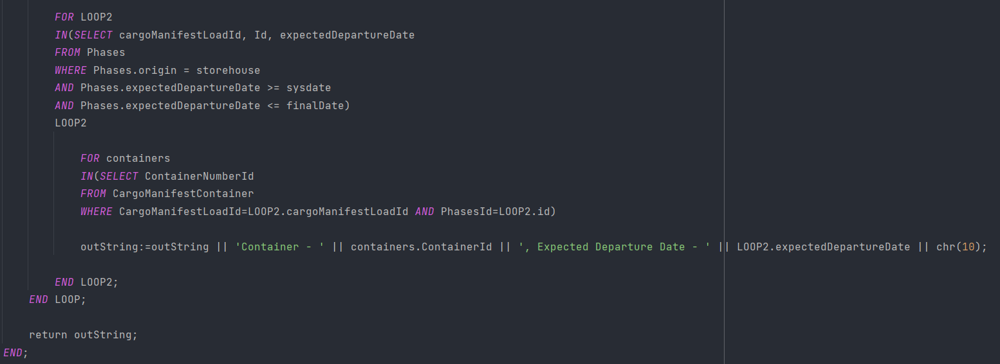

## *Script Outputs Confirmation*
#### 1. Primeiro adicionamos um contentor apenas em uma Warehouse chamada "Warehouse2" cujo sua ocupação inicialmente era zero e sua capacidade 200 m3, sendo assim como o cálculo da ocupação é feito em percentagem deveremos obter o resultado 0,5%
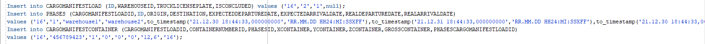
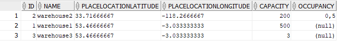

#### 2. Adicionamos agora 11 contentores na "Warehouse1" e automaticamente sua ocupação mudou para 2,2%
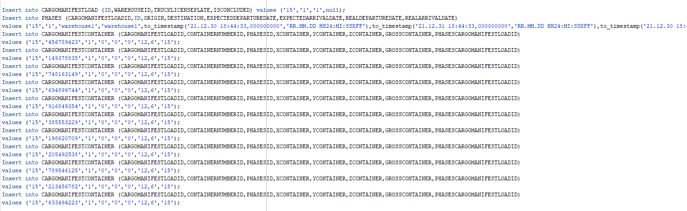
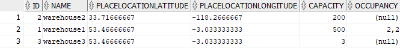

#### 3. De seguida, fizemos inputs de alguns contentores que sairiam de um armazém nos próximos 30 dias e outros não e o resultado obtido foi o seguinte
##### 3.1 Contentores que tem a data de partida nos próximos 30 dias 
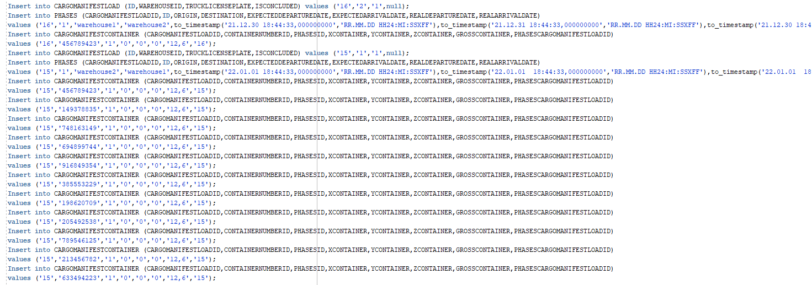

##### 3.2 Contentores que não tem a data de partida prevista dentro dos 30 dias
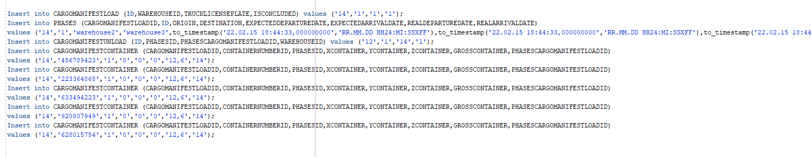

#### 4. Output do "PROCEDURE" "getOccupancyOfWarehouse"

