## US307 - As Port manager, I intend to get a warning whenever I issue a cargo manifest destined for a warehouse whose available capacity is insufficient to accommodate the new manifest.

## *Requirements Engineering*
#### SSD - System Sequence Diagram
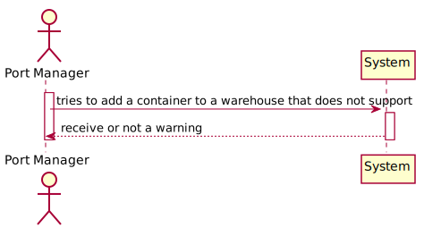
#### DM - Domain Model
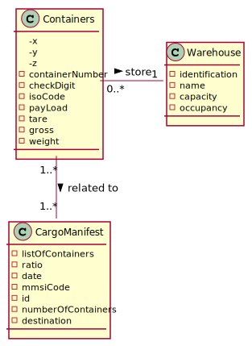
#### CD - Class Diagram
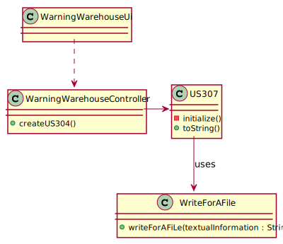
#### SD - Sequence Diagram
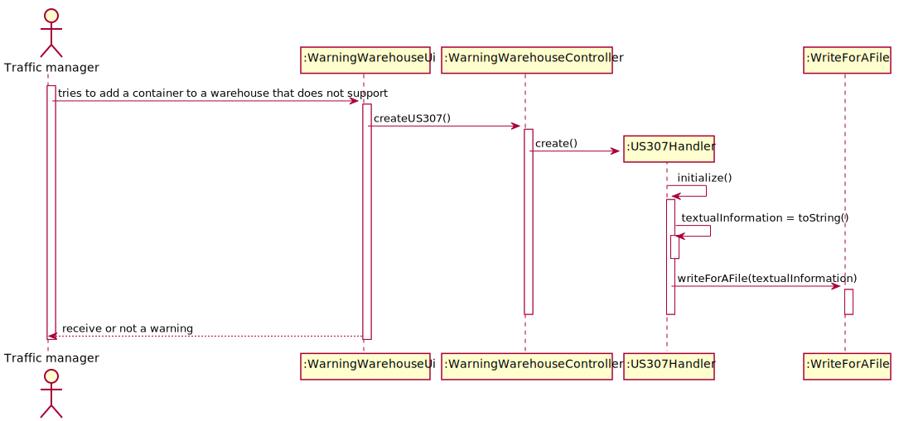

## *Script Analysis*

#### 1. Para atender os requisitos impostos pela US307, começamos por criar um Trigger responsável por calcular a ocupação de um Armazém sempre que um novo contentor é adicionado ou retirado de um armazém. Para isso, começamos por guardar na variável "destAux" o destino de um determinado contentor.
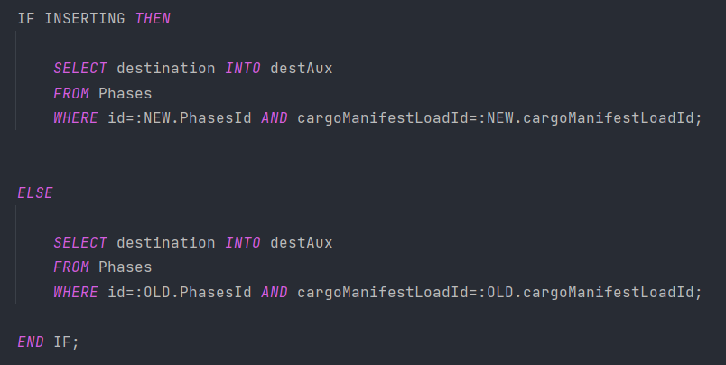

#### 2. Depois de guardarmos na variável "destAux" o destino do contentor temo de verificar se esse destino corresponde ao nome de um Armazém pois, o destino de um contentor pode corresponder ao nome de um Porto ou de um Armazém.
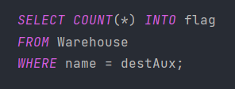

#### 3. Caso a variável corresponda ao nome de um armazém, iremos armazenar o ID desse armazém na variável "dest".
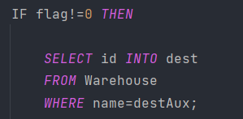

#### 4. Posteriormente, para cada Cargo Manifest Unload iremos buscar o Cargo Manifest Load ID  e a Phase Id associados e guardaremos nas variáveis "cmLoad" e "TripId". Posteriormente a isto, faremos um ciclo FOR para selecionar todos os CargoManifestContainer associados com o "cmLoad" e o "TripId" para que possamos achar o último Cargo Manifest associado a um contentor, caso seja o último  Cargo Manifest associado ao contentor então, contabilizaremos esse contentor para a ocupação do armazém a qual ele está associado.
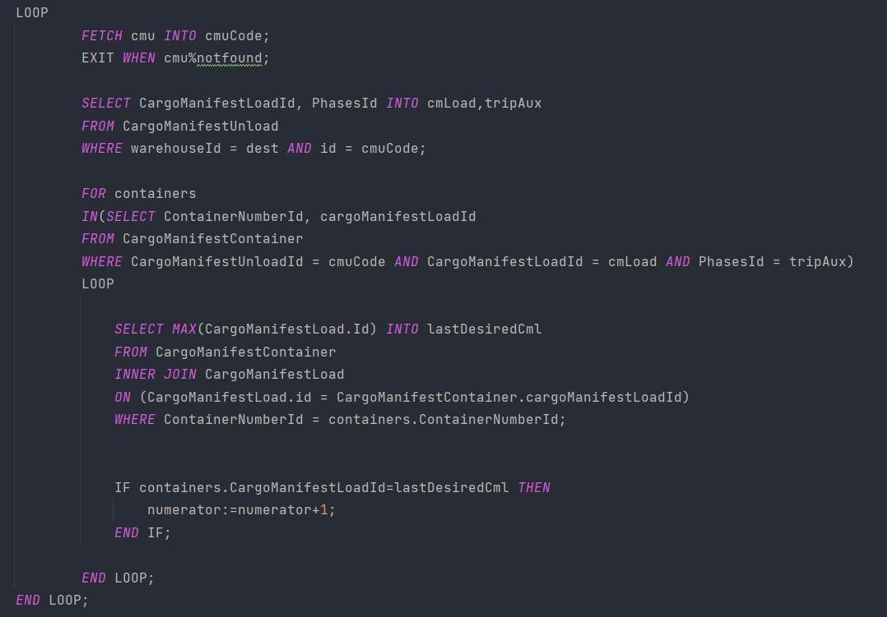

#### 5. Para além, de contabilizar os contentores que já se encontram no armazém, optamos por também contabilizar os contentores que tem como destino e chegam em breve aquele armazém.
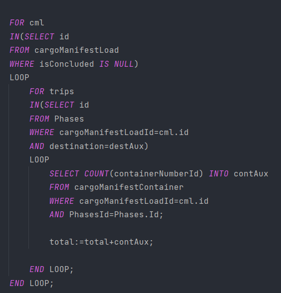

#### 6. Após contabilizarmos todos os contentores, iremos selecionar a capacidade da warehouse com o ID igual ao da variável "dest" e faremos o cálculo da ocupação e armazenaremos na variável "ocRate". Após a realização do cálculo iremos verificar se a ocupação desse armazém é menor que 100% caso seja adicionamos os novos contentores e damos "UPDATE" a sua ocupação, caso contrário lançamos uma exceção para dizer que o armazém se encontra na sua ocupação máxima.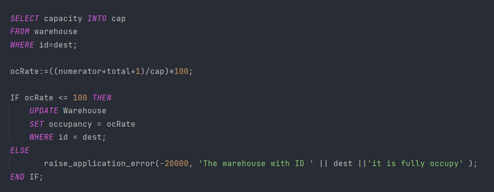 

## *Script Outputs Confirmation*

#### 1. Começamos por verificar que a capacidade da "Warehouse3" é 3 
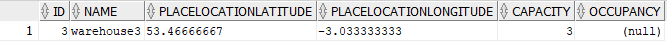

#### 2. De seguida, adcionaremos 3 contentores a "Warehouse3" e sua capacidade passará a 100%
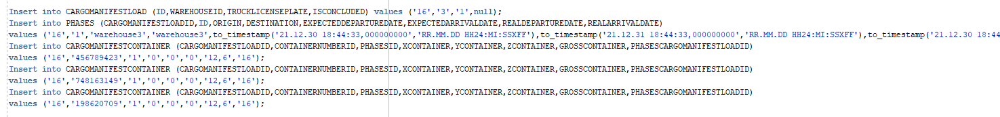
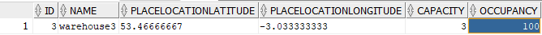

#### 3. Ao tentar adcionar outro contentor na "Warehouse3" receberemos um aviso e não será possível adicionar o novo contentor a este armazém visto que já está com a sua capacidade máxima preenchida 
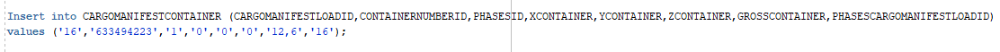
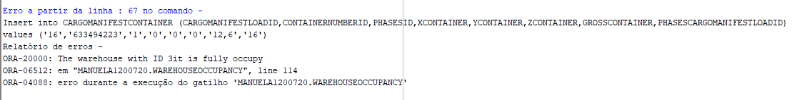