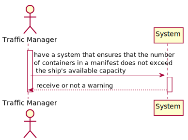
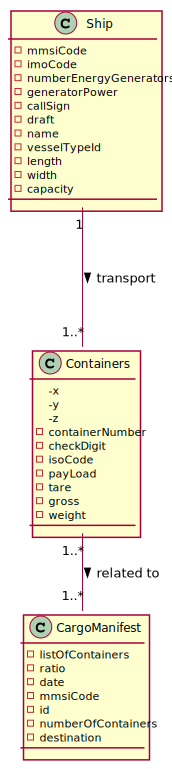
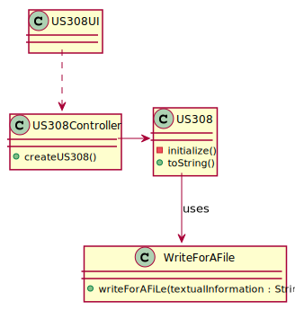
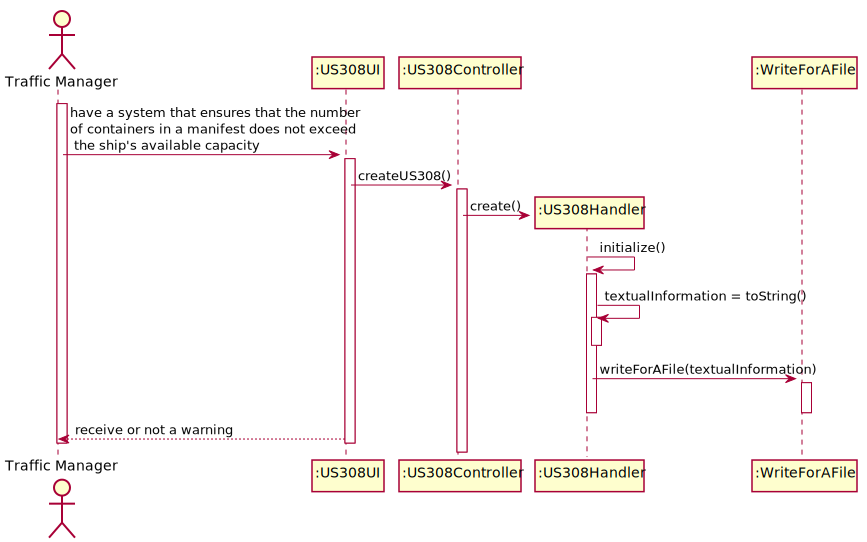
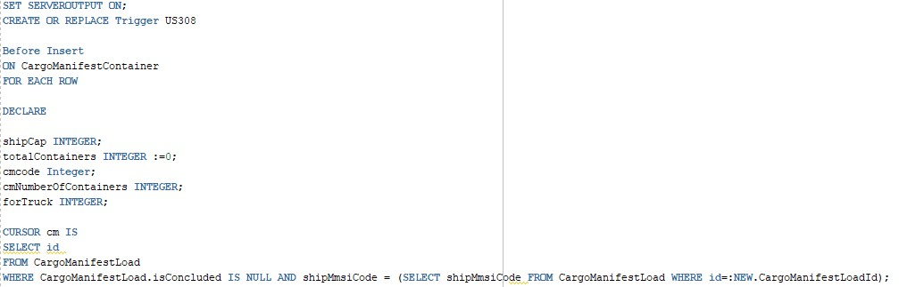
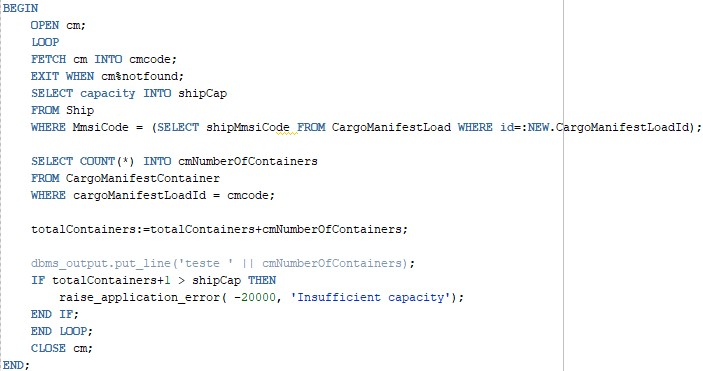
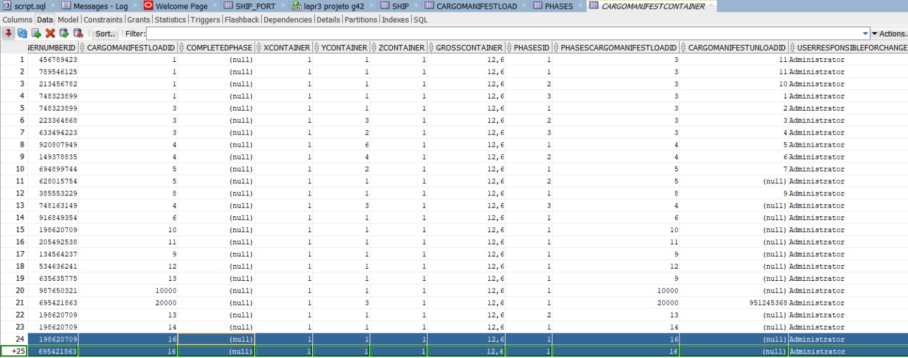
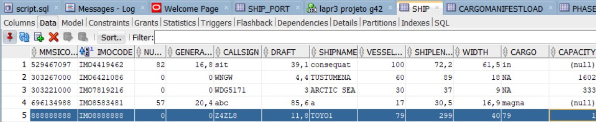
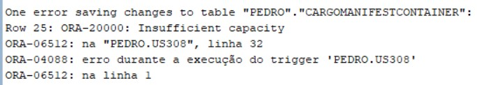

## US308 - As Traffic manager, I want to have a system that ensures that the number of containers in a manifest does not exceed the ship's available capacity.

---

## *Requirements Engineering*
#### SSD - System Sequence Diagram

#### DM - Domain Model

#### CD - Class Diagram

#### SD - Sequence Diagram

---

## *Script Analysis*
#### Para atender os requisitos impostos pela US308, começamos por criar um Trigger que não permite que o número de Contentores num Cargo Manifest exceda a capacidade disponível no Ship. Iterou-se os Cargo Manifest incompletos do respectivo Ship.

#### Guardou-se na variável "shipCap" a capacidade do Ship respetivo. Guardou-se também na variável "cmNumberOfContainers" o número de containers do Cargo Manifest. Se o número total de Containers do Cargo Manifest for superior à Capacidade do Ship, o trigger será disparado.

---

## *Script Demonstration*
#### Como o Ship tem capacidade 1, ao tentar inserir um segundo contentor, lançar-se-á um erro visto que ja passa do limite.
###### Cargo Manifest Container

###### Ship

###### Output
