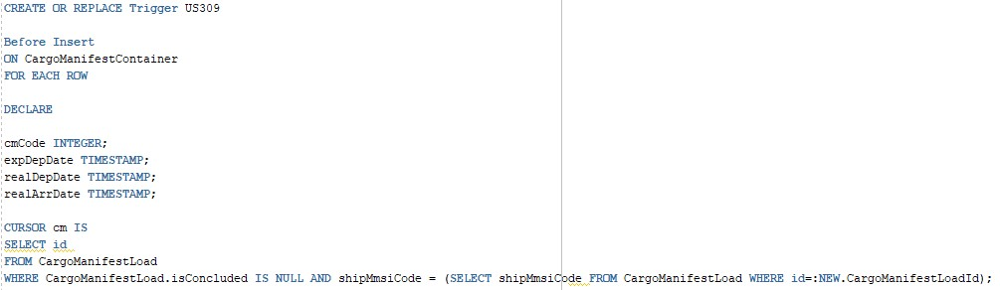

## US309 - As Traffic manager, I do not allow a cargo manifest for a particular ship to be registered in the system on a date when the ship is already occupied.

## *Requirements Engineering*
#### SSD - System Sequence Diagram

#### DM - Domain Model

#### CD - Class Diagram

#### SD - Sequence Diagram

---

## *Script Analysis*

#### Para atender os requisitos impostos pela US309, começamos por criar um Trigger que não permite um determinado Ship ser registado se já estiver ocupado. Iterou-se os Cargo Manifest incompletos do respectivo Ship.

#### Depois guardou-se na variável "expDepDate" a data de partida esperada proveniente da tabela phases cujo CargoManifestLoadId seria igual ao a ser criado. De seguida iteraram-se as datas de forma a ver se se encontrava no período em que o Ship estaria em "viagem", se sim, o trigger disparará.

--- 

## *Script Demonstration*
#### Criou-se o Cargo Manifest de id 15 que terá o mesmo Ship que o Cargo Manifest de id 1. O objetivo é surgir o aviso de que o Ship está "ocupado".

#### O ship estará em viagem de dia 2/10/21 a 15/10/21.

#### Para efeito de teste, pedimos para ser carregado dia 05/10/21, o que não será possível uma vez que se encontra em viagem.

#### Surge o trigger a dizer que o registo do Cargo Manifest não foi possível.

---