## US310 As Port manager, I intend to have a map of the occupation of the existing resources in the port during a given month.

## *Requirements Engineering*
#### SSD - System Sequence Diagram
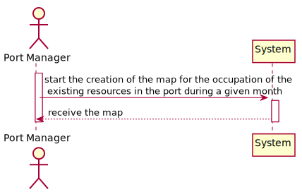
#### DM - Domain Model
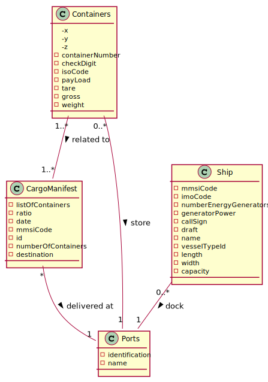
#### CD - Class Diagram
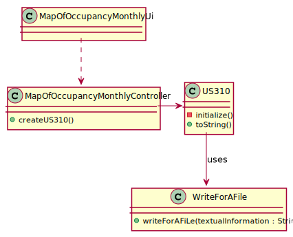
#### SD - Sequence Diagram
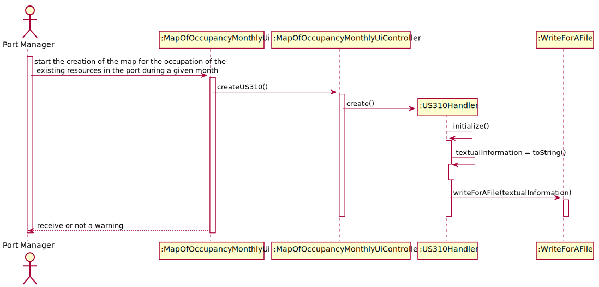

## *Script Analysis and Outputs confirmations*

#### 1. Como podemos ver na tabela Phases, para o porto "dest1" o primeiro barco chega dia 3, como visível no output. No dia 5 chega mais um barco que permanece até dia 12, ao contrário do anterior que apenas permanece até dia 10, mais uma vez, visível no output. Dia 13, a "occupancy" de barcos volta a ficar 0, pois nenhum dos dois barcos está lá.
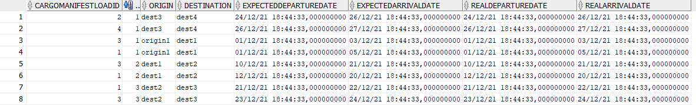
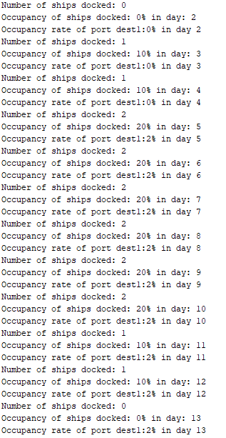

#### 2. Já para dest2, o primeiro barco chega ao porto dia 20 enquanto o segundo chega dia 21, saindo o primeiro no dia 21 e o segundo no dia 23, tendo então a "occupancy" mais alta no dia 21, quando estão os dois barcos.
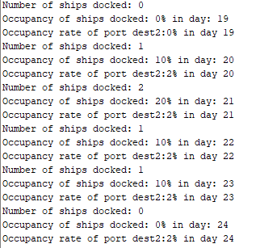

#### 3. O mesmo acontece para o porto dest3, como se pode ver pela tabela e pelo output
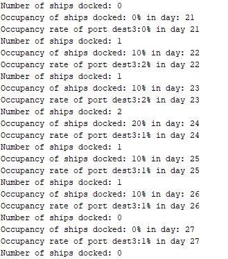

#### 4. Já para o porto dest4, como não há mais nenhuma viagem para nenhum dos barcos, assumimos que o barco continua no porto, ficando o primeiro barco no Porto desde dia 26 e o segundo desde dia 27
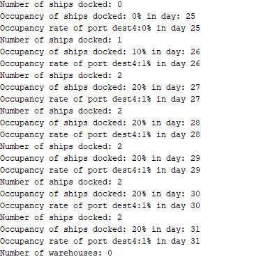

#### 5. Falando agora da "occupancy" de contentores no porto, como podemos ver na tabela cargoManifestContainer, para o porto dest1, dest2, dest 3, são utilizados sempre contentores diferentes, diferentemente do que acontece na viagem para o porto dest4, onde é utilizado o contentor que anteriormente estava em dest3, sendo ess afirmação comprovada pelas imagens de output a seguir.
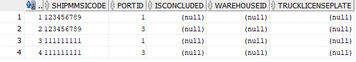
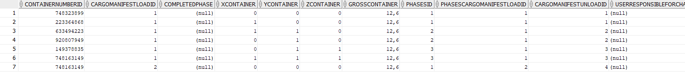
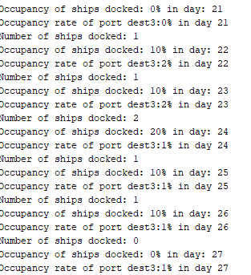

#### 6. Como podemos ver a "occupancy" do porto estava nos 2%, mas com a saida do contentor no dia 24, ela baixou para 1% apenas. Como o barco chegava ao porto dest4 no dia 26, a ocupancy rate de contentores aumenta 1% com o contentor que chegou
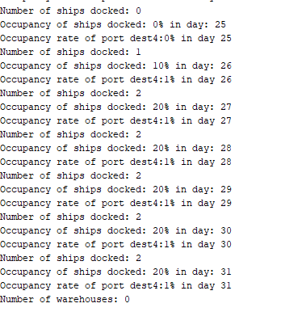