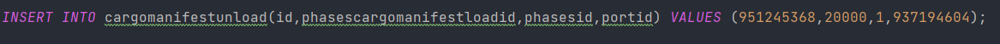

## US312 - As Client, I want to know the current situation of a specific container being used to transport my goods
## *Requirements Engineering*
#### SSD - System Sequence Diagram

#### DM - Domain Model

#### CD - Class Diagram

#### SD - Sequence Diagram

## *Script Analysis*

#### 1. Primeiro, foi criado um cursor para iterar todo o CargoManifestContainer onde o atributo containerNumberId é igual ao container identifier dado pelo cliente para obtermos todos os id de cargoManifestLoad em que o contentor estava incluído.

#### 2. Posteriormente iremos verificar se o "ClientOwner" do contentor é igual ao "ClientOwner" recebido por parâmetro.

#### 3. Posteriormente, iteramos por todos os cargosManifestsLoadId, para obtermos caso exista o respetivo cargoManifestUnloadId.

#### 4. Caso o respetivo cargoManifestUnloadId seja NULL quer dizer que o contentor está a ser transportado por um navio até ao respetivo porto, e como o contentor só pode estar a ser transportado por um barco de cada vez só pode existir um cargoManifestLoad nesta situação. Para saber em que navio o contentor do cliente está a ser transportado obtemos o shipMmsiCode presente no cargoManifestLoad respetivo e com o shipMmsiCode conseguimos obter o nome do navio para informar o cliente. Caso o contentor em questão esteja no navio a função termina a sua execução.

#### 5. Caso não exista nenhum cargoManifestUnloadId a NULL é sinal que o container se encontra num porto. Posto isto temos que saber qual foi o último porto a que chegou, e sabemos isto com a realDataArrival que se encontra na classe phases. Para obter a respetiva tabela phases e conseguir saber a realDataArrival e qual era o seu porto de destino recorro ao atributo phasesId de cargoManifestUnload.

#### 6. Como vou comparando todos as datas e guardando a mais recente e o respetivo destino, no final do loop a variável v_locationName tem o nome do porto em que o contentor se encontra.

## *Script Outputs Confirmation*

#### 1. Primeiros adicionamos dois Cargo Manifest Load para poder testar esta Us 

#### 2. De seguida, adicionamos fases para esse dois cargo Manifests 

#### 3. Adcionamos também um Cargo Manifest Unload para o Cargo Manifest Load com o ID "2000"

#### 4. E por fim , adicionamos os CargoManifestContainer relacionados com contentores e com os Cargo Manifest Load 

#### 5. Como o Cargo Manifest Load de Id 2000 possui um Cargo Manifest Unload a localização do contentor será igual ao Porto em que este foi descarregado, sendo o nome do Porto de destino "nec", como podemos ver na figura abaixo o resultado é exatamente este 

#### 6. Já o Cargo Manifest Load com ID 1000 não possui nenhum Cargo Manifest Unload, sendo assim, buscaremos o barco em que o contentor que o barco se encontra que neste caso será "consequat"

