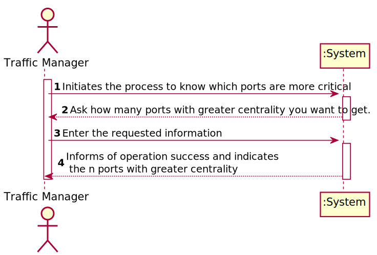
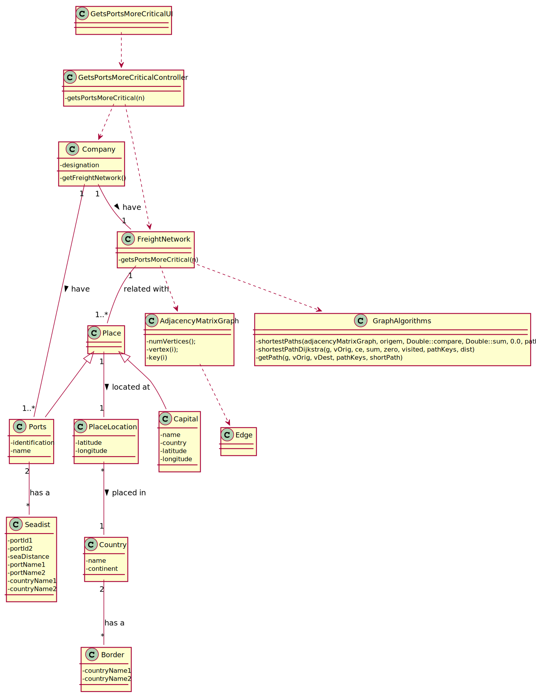
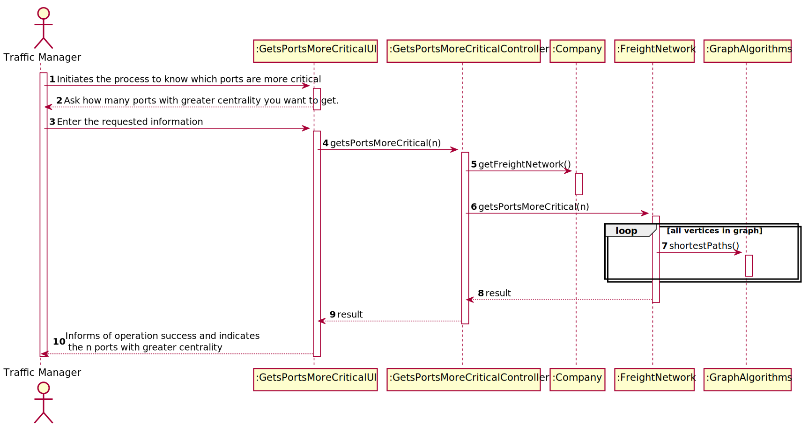

## US401 - As a Traffic manager I wish to know which ports are more critical (have greater centrality) in this freight network.

## *Requirements Engineering*
#### SSD - System Sequence Diagram

#### DM - Domain Model

#### CD - Class Diagram

#### SD - Sequence Diagram

## *Decision Making*

## *Complexity Analysis*

