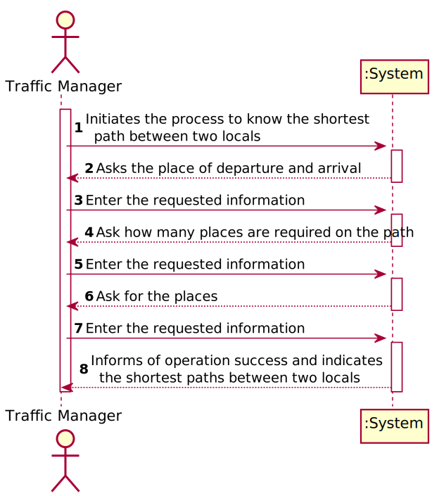
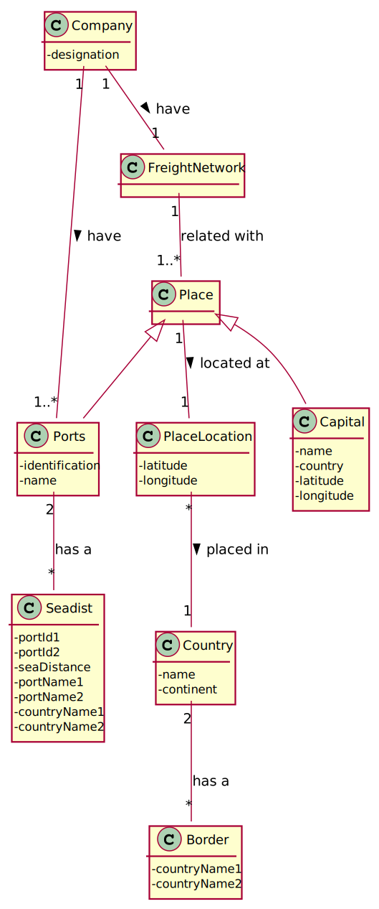

## US402 - As a Traffic manager I wish to know the shortest path between two locals (city and/or port).

## *Requirements Engineering*
#### SSD - System Sequence Diagram

#### DM - Domain Model

#### CD - Class Diagram

#### SD - Sequence Diagram

## *Decision Making*

## *Complexity Analysis*

