## US404 - As Fleet Manager, I want to know the number of days each ship has been idle since the beginning of the current year.

## *Requirements Engineering*
#### SSD - System Sequence Diagram
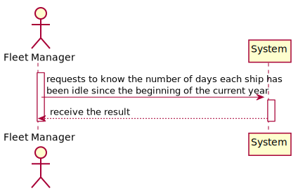
#### DM - Domain Model
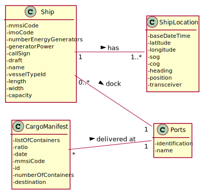
#### CD - Class Diagram
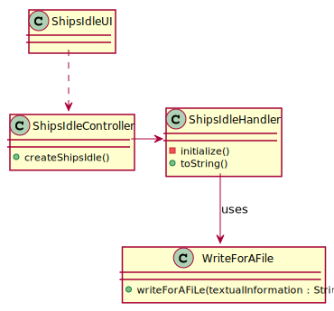
#### SD - Sequence Diagram
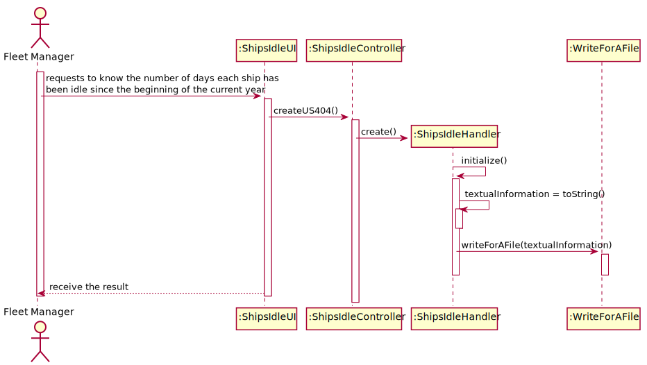

## *Script Analysis*

#### 1. Para podermos cumprir os requisitos imposto pela US404 primeiro precisamos de um "Cursor" para iterar todos os barcos presentes no nosso sistema
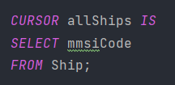

#### 2. Posteriormente, criamos um "Cursor" de todos os "Cargo Manifests Load" associados com um determinado barco em que o ano de início ou fim de viagem correspondam ao ano atual
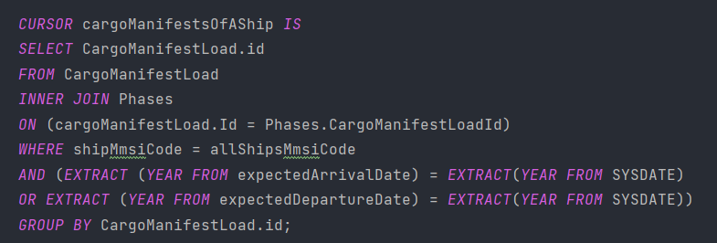

#### 3. Usamos o booleano "flag" para saber os barcos que não tiveram nenhum "Cargo Manifest Load" associado durante o ano, sendo assim, nos deparamos com duas situações:
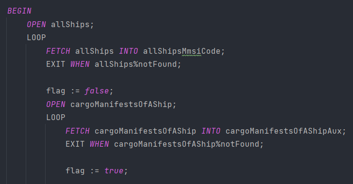
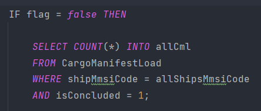

#### 3.1 Primeira situação, o barco não trabalhou durante o ano todo, sendo assim o total de "Cargo Manifest Load" deste barco será igual a zero
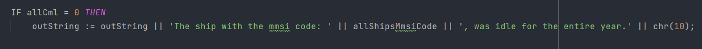

#### 3.2 Segunda situação, o barco permaneceu em uma mesma viagem durante todo o ano e só a completou no ano a seguir
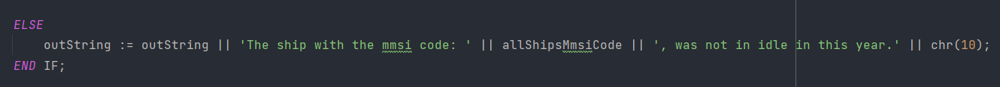

#### 4. Caso o barco tenha tido várias viagens, iremos iterar todos as fases associadas a um determinado "Cargo Manifest Load" associado a um barco e contabilizaremos todas as horas trabalhadas por este, em seguida, iremos subtrair o total de dias trabalhados do total de dias que constituem um ano
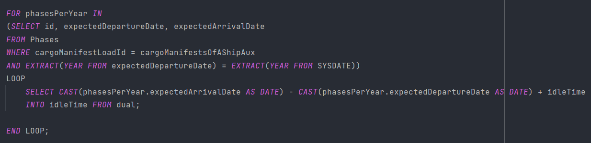
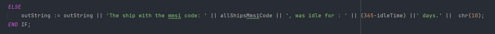

## *Script Outputs Confirmation*

#### Para testarmos o script adicionamos dois barcos a base de dados, um deles esteve parado por 54 e o outro durante o ano inteiro.

###### Ships
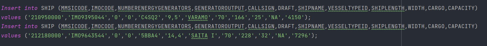

##### Cargo Manifest Load
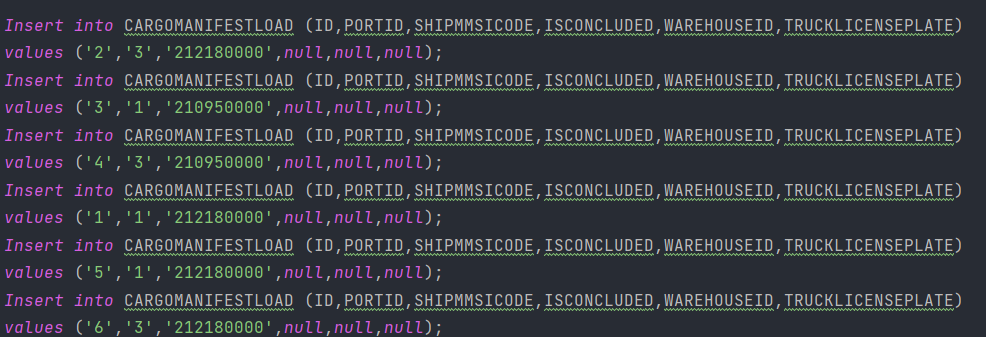

##### Phases 
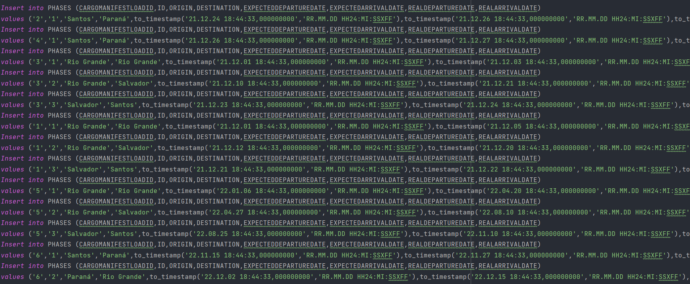

##### Output
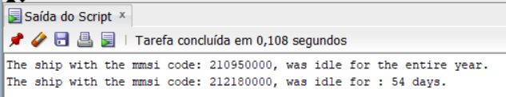

