## US405 - As Fleet Manager, I want to know the average occupancy rate per manifest of a given ship during a given period.

## *Requirements Engineering*
#### SSD - System Sequence Diagram
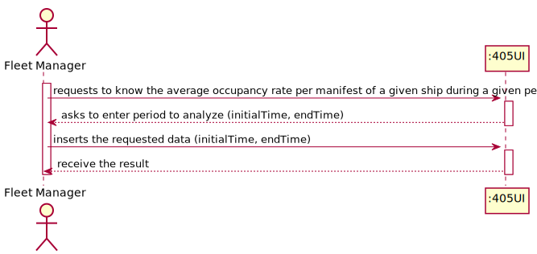
#### DM - Domain Model

#### CD - Class Diagram
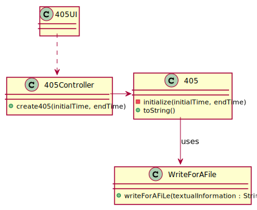
#### SD - Sequence Diagram
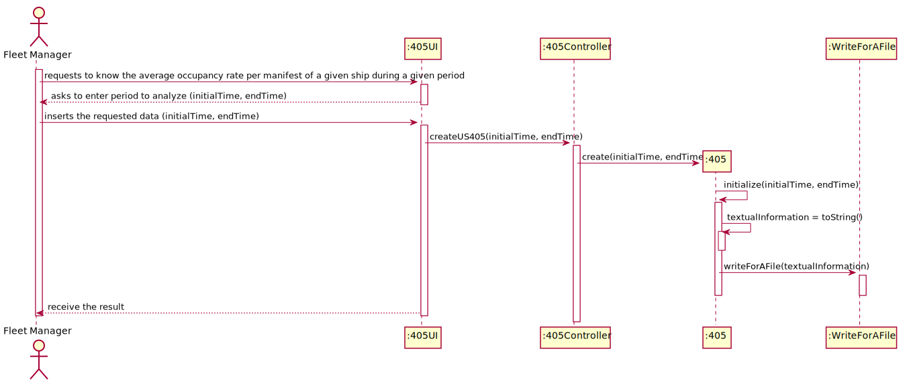

## *Script Analysis*
#### Para podermos cumprir os requisitos impostos pela US405, recebemos por parâmetro o período de tempo a avaliar limitado pela data de início e de término assim como o identificador do navio.
#### Criaram-se 2 cursores, um para os Cargo Manifestos e outro para as fases, ambos compreendidos no período fornecido para o respetivo navio.
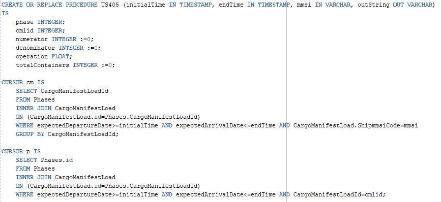
#### A taxa de ocupação é dada pelo quociente dos contentores efetivamente presentes no navio, pela capacidade de contentores do navio em questão. 
#### Guarda-se na variável "denominator" a capacidade do navio uma vez que vai ser o denominador da fração.
#### Para cada Cargo Manifest, iteraremos as fases e efetuaremos a contagem dos Contentores nesse Cargo Manifest.
#### Retomaremos a Taxa de Ocupação por cada Cargo Manifest compreendidos no período.
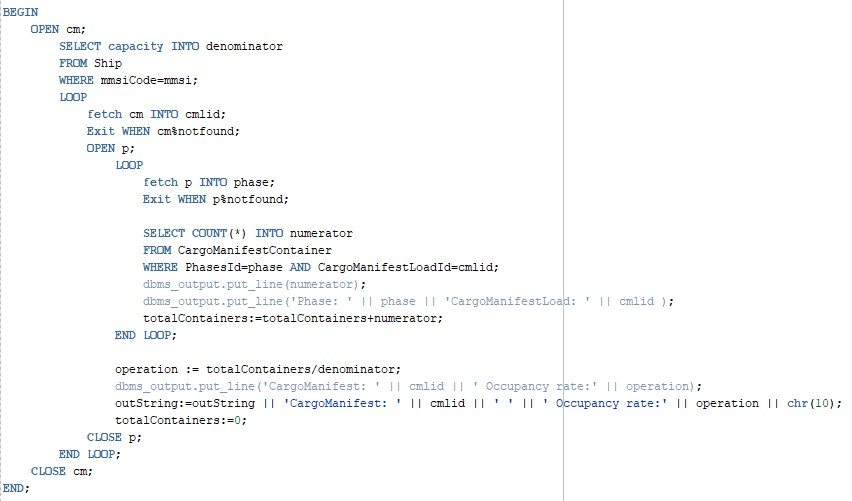

## *Script Outputs Confirmation*
#### Para efeito de confirmação do Output do Script, procuramos saber a taxa de ocupação do navio "210950000" desde "21/10/02 18:44:33" até "21/12/30 18:44:33".
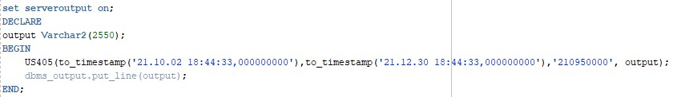

#### O Ship em questão tem uma capacidade de 4150 contentores.
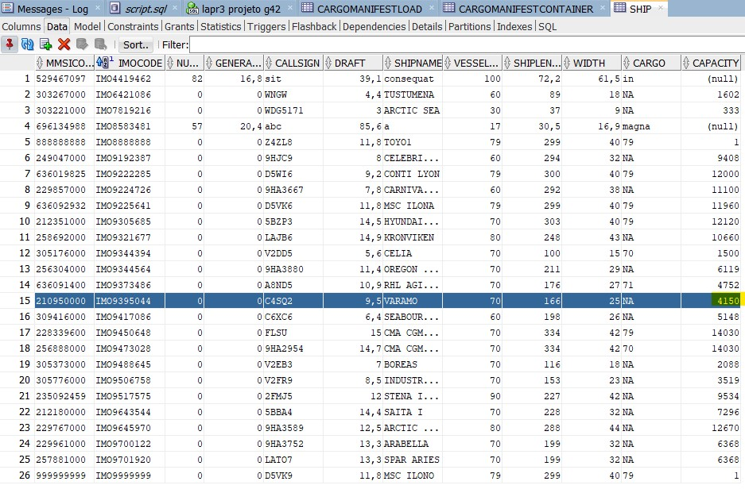

#### Cargo Manifest Load
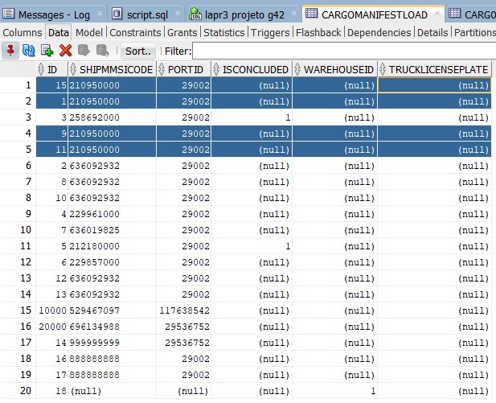

#### Tabela Phases para os Cargo Manifests do Ship 210950000 no respetivo intervalo.
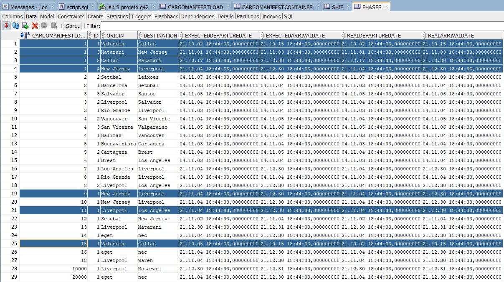

#### Cargo Manifest Container 
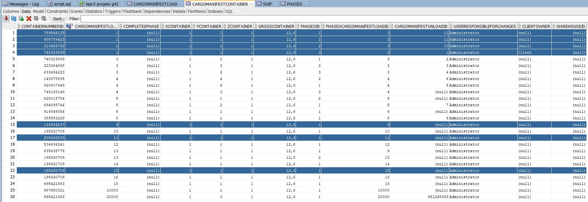

#### Output
###### Para o Cargo Manifest 1, o resultado será 0,096% uma vez que (4/4150)*100=0,096%
###### Para o Cargo Manifest 9, o resultado será 0,096% uma vez que (1/4150)*100=0,024%
###### Para o Cargo Manifest 11, o resultado será 0,096% uma vez que (1/4150)*100=0,024%
###### Para o Cargo Manifest 15, o resultado será 0,096% uma vez que (1/4150)*100=0,024%
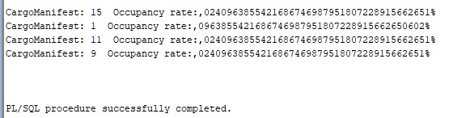