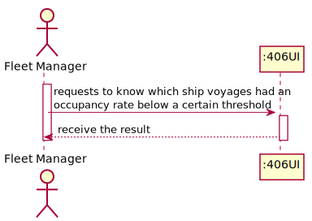
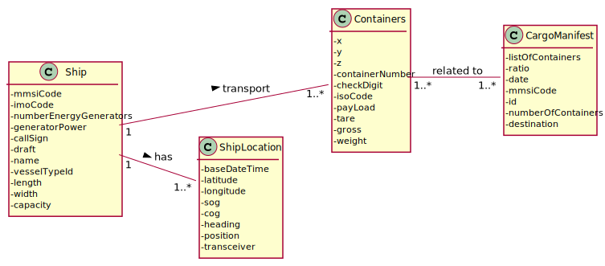
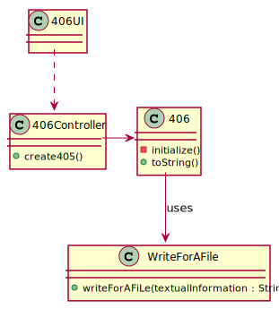
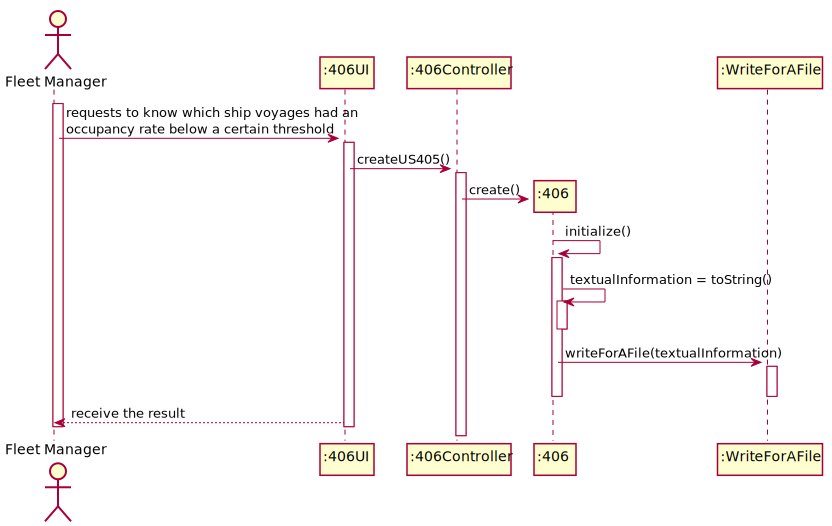
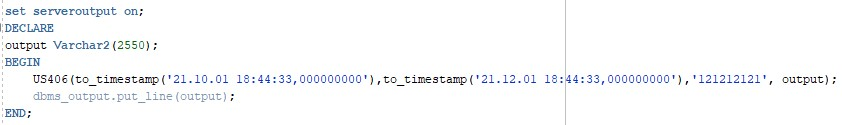
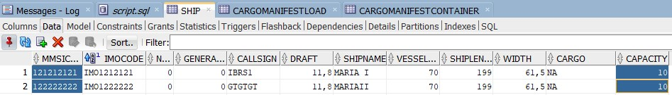
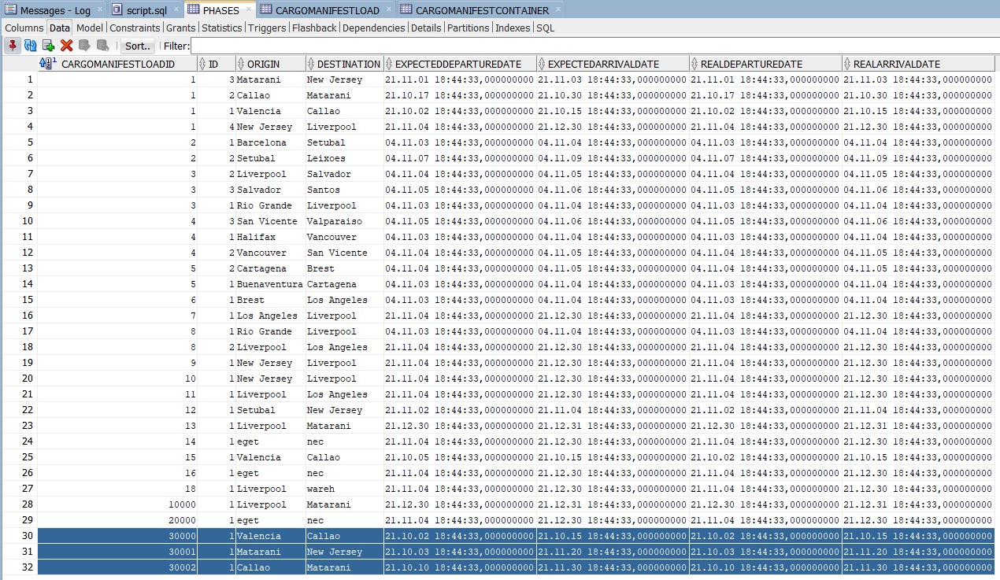
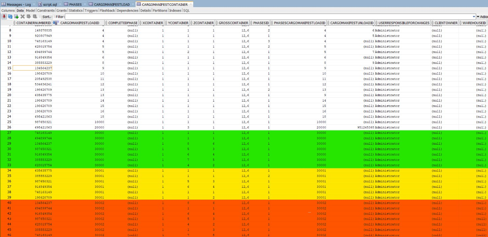
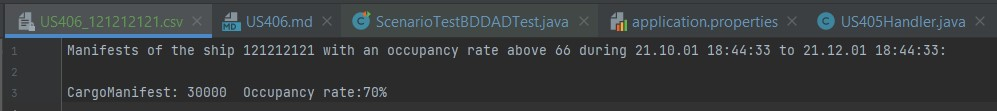

## US406 - As Fleet Manager, I want to know which ship voyages – place and date of origin and destination – had an occupancy rate below a certain threshold; by default, consider an occupancy rate threshold of 66%. Only the trips already concluded are to be considered.
## *Requirements Engineering*
#### SSD - System Sequence Diagram

#### DM - Domain Model

#### CD - Class Diagram

#### SD - Sequence Diagram

## *Script Analysis*
#### Para podermos cumprir os requisitos impostos pela US406, recebemos por parâmetro o tempo a avaliar limitado pela data de início e de término assim como o identificador do navio.
#### Criaram-se 2 cursores, um para os Cargo Manifestos e outro para as fases, ambos compreendidos no período fornecido para o respetivo navio.

#### A taxa de ocupação é dada pelo quociente dos contentores efetivamente presentes no navio, pela capacidade de contentores do navio em questão.
#### Guarda-se na variável "denominator" a capacidade do navio visto que vai ser o denominador da fração.
#### Para cada Cargo Manifest, iteraremos as fases e efetuaremos a contagem dos Contentores nesse Cargo Manifest.
#### Retomaremos as Taxas de Ocupação superiores a 66% por cada Cargo Manifest Load concluído, compreendidos no período.

## *Script Outputs Confirmation*
#### Para efeito de confirmação do Output do Script, procuramos saber a taxa de ocupação do navio "121212121" desde "21/10/01 18:44:33" até "21/12/01 18:44:33".

#### O Ship em questão tem uma capacidade de 10 contentores.

#### Cargo Manifest Load

#### Tabela Phases para os Cargo Manifests do Ship 121212121 no respetivo intervalo.

#### Cargo Manifest Container

#### Para confirmação do output fizemos os seguintes três exemplos:
* Para o Cargo Manifest 30000, o resultado será 70% uma vez que (7/70)*100=70% - este será o único Cargo Manifest retornado. 
* Para o Cargo Manifest 30001, o resultado será 60% uma vez que (6/70)*100=60%.
* Para o Cargo Manifest 30002, embora o resultado será 70% uma vez que (7/70)*100=70%, como o Cargo Manifest Load não está concluído não é devolvido.
