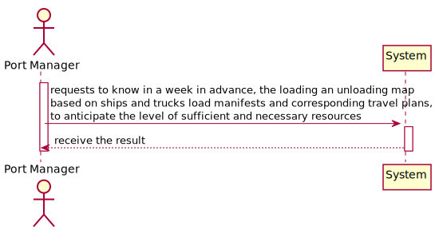
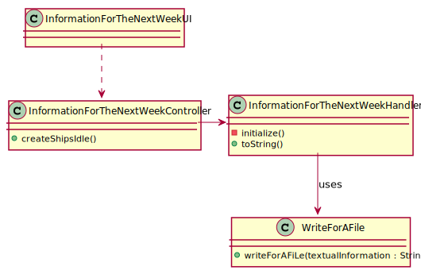
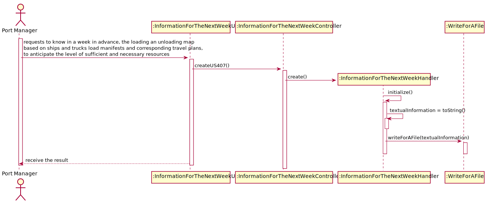
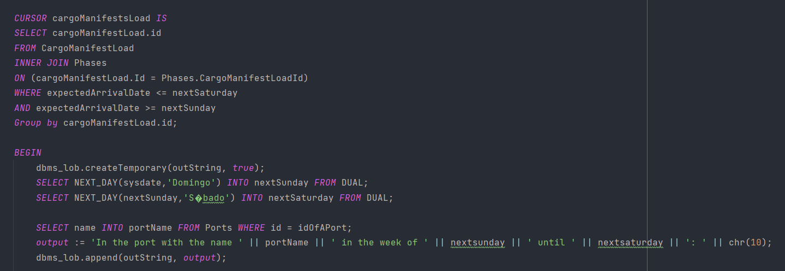
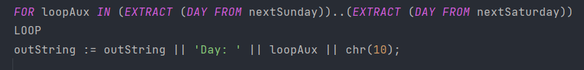
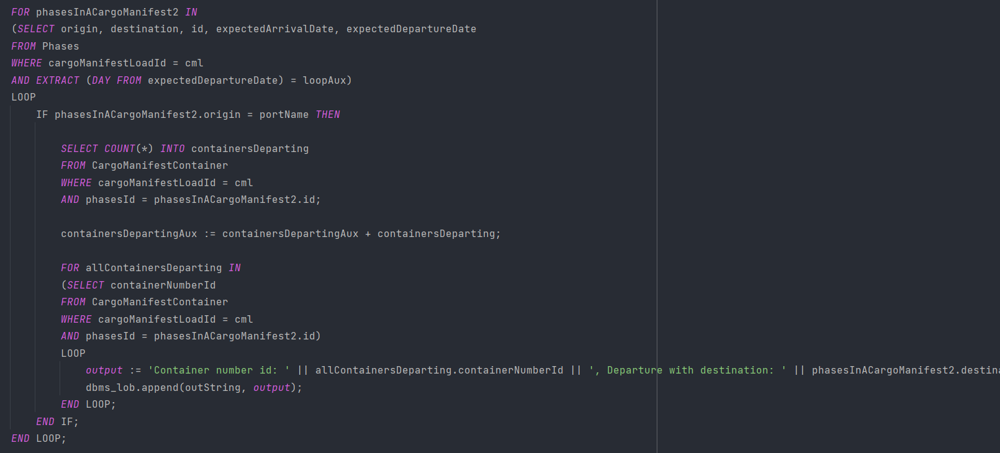
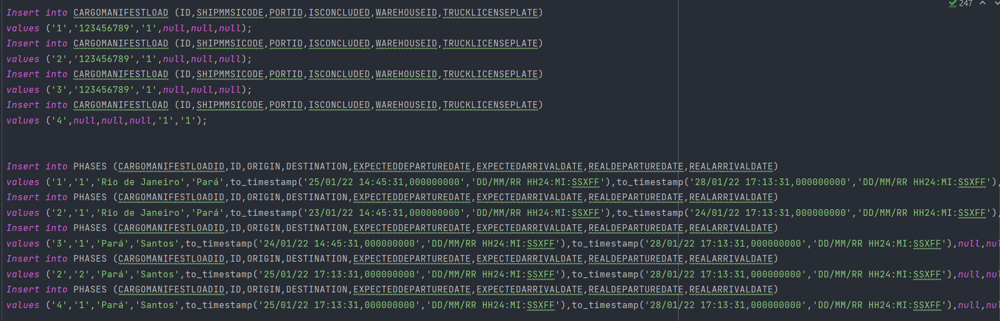
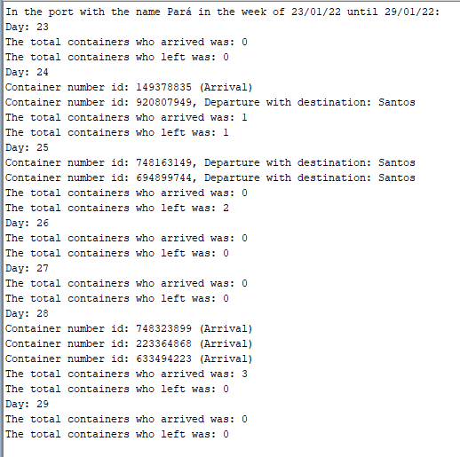

## US407 - As Port manager, I intend to generate, a week in advance, the loading and unloading map based on ships and trucks load manifests and corresponding travel plans, to anticipate the level of sufficient and necessary resources (loading and unloading staff, warehouse staff, ...).

## *Requirements Engineering*
#### SSD - System Sequence Diagram

#### DM - Domain Model

#### CD - Class Diagram

#### SD - Sequence Diagram

## *Script Analysis*

#### 1. Começamos, por criar um "CURSOR" para iterar todos os Cargo Manifest Load cuja as fases estivessem entre a data da próxima semana, consideramos que a semana começa no domingo e termina no sábado.

#### 2. Em seguida, faremos um ciclo "FOR" para percorrer os dias da semana.

#### 3. Dentro deste ciclo, iremos iterar todas as fases de um Cargo Manifest e verificar se o seu destino ou partida correspondem ao nome do porto que foi inserido por parâmetro, caso seja, iremos adicionar este contentor assim como a informação se esta partindo ou chegando no Porto inserido por parâmetro. 

## *Script Outputs Confirmation*

#### Para efeito de testes inserimos os seguintes Cargo Manifest Load com as seguintes fases

#### Como podemos ver pelas datas de chegada e saída obteremos o seguinte output
