## US418 - As the Ship Captain I want the determine the unladen center of mass for each vessel (if different) according to its characteristics. For calculation purposes, consider known geometric figures.
#### Acceptance Criteria [LAPR3]:

* Make a sketch of the vessel's geometric figure.
* Identify/choose a reference for the calculation.
* Determine the center of mass for the different vessels (consider that the vessel is all made of the same material).

## *Requirements Engineering*
#### SSD - System Sequence Diagram
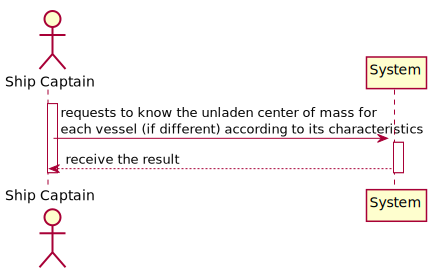
#### DM - Domain Model
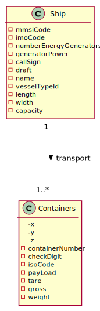
#### CD - Class Diagram
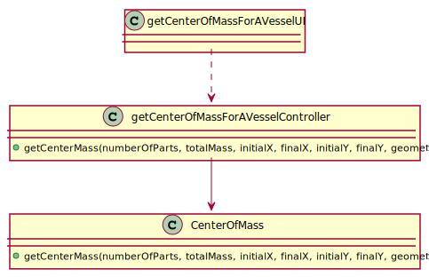
#### SD - Sequence Diagram
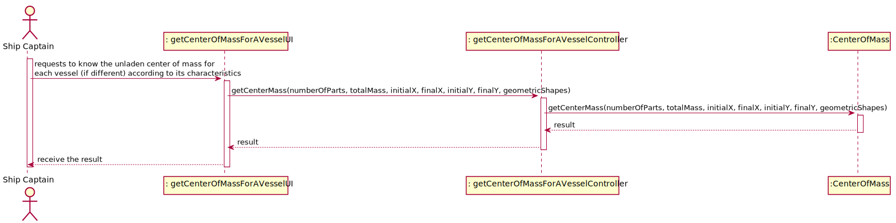

## US Logic

For this User Story, it is required to calculate the center of mass for each Vessel. So, after choosing the different types, it is also required to make a sketch of the different
ships. Therefore:

* Reefer Vessel
  * Top View: 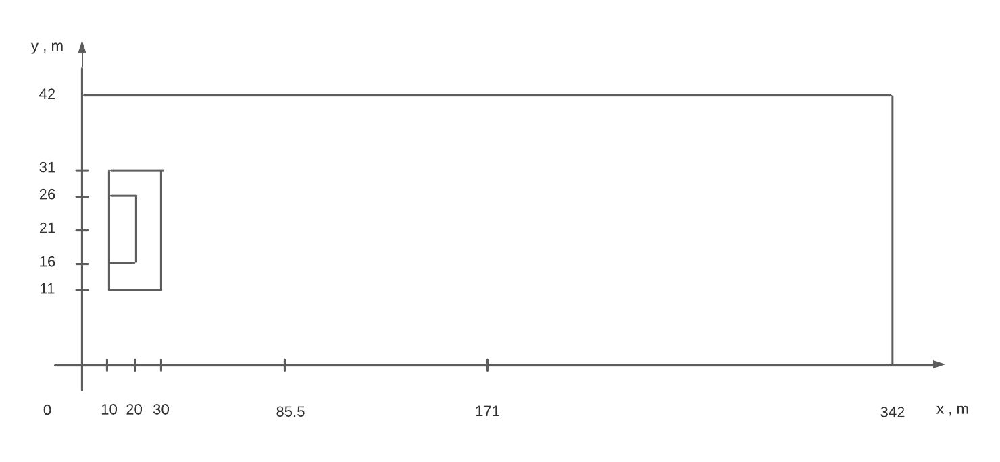

  * Top View with center of mass identified: 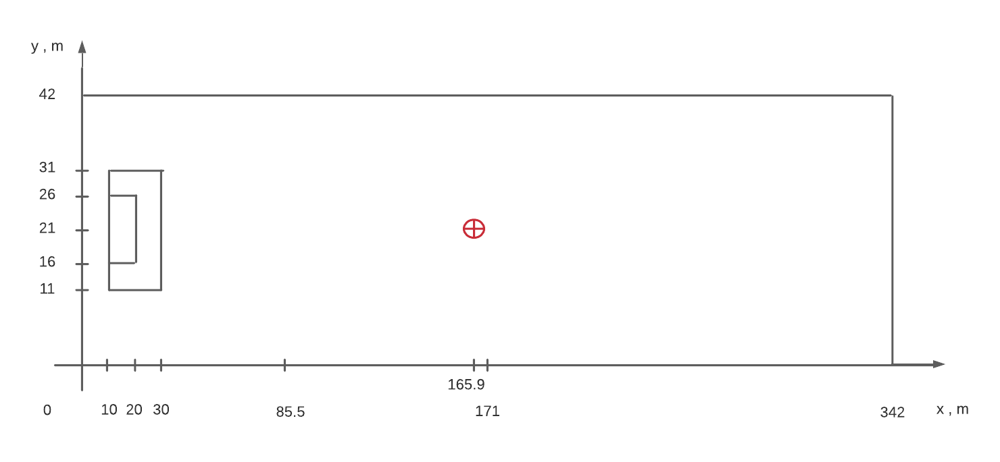

  * Side View: 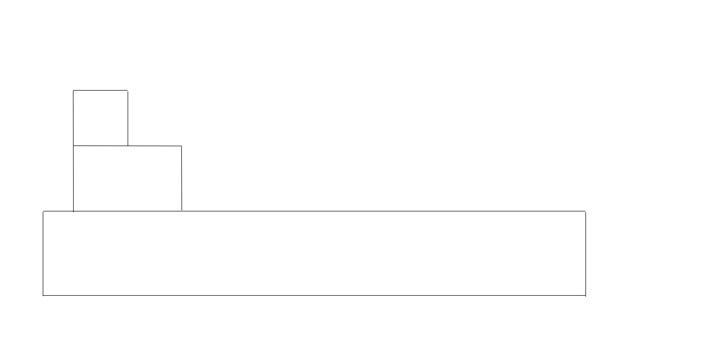

* Container Ship
  * Top View: 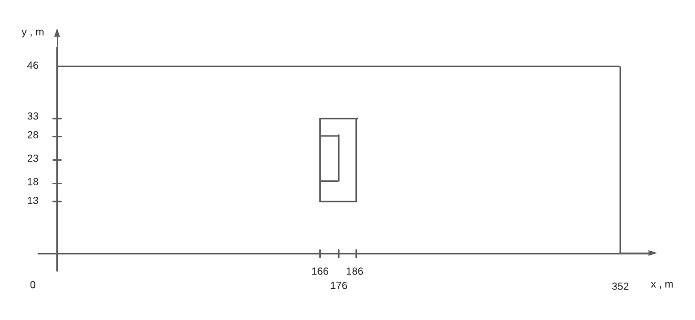

  * Top View with center of mass identified: 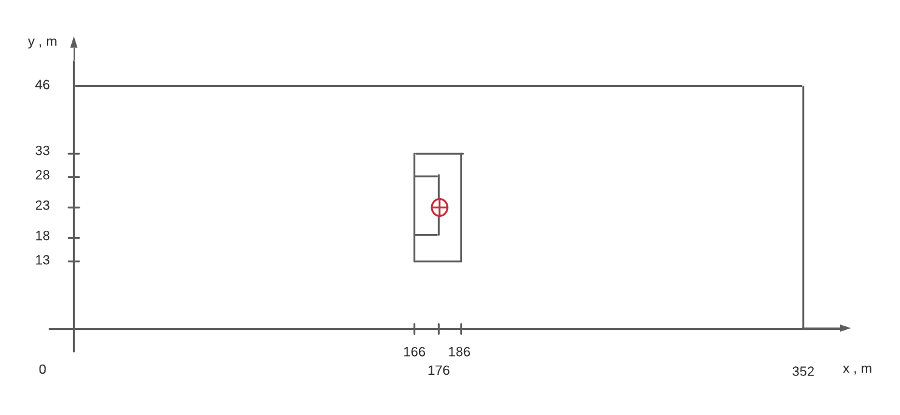

  * Side View: 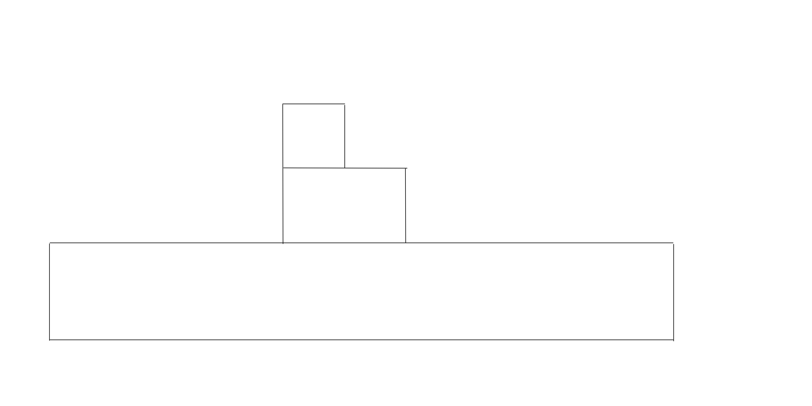

* Lake Freighter
    * Top View: 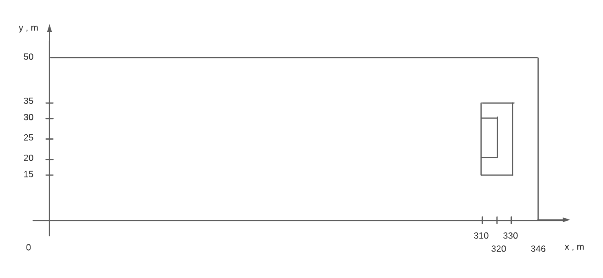

    * Top View with center of mass identified: 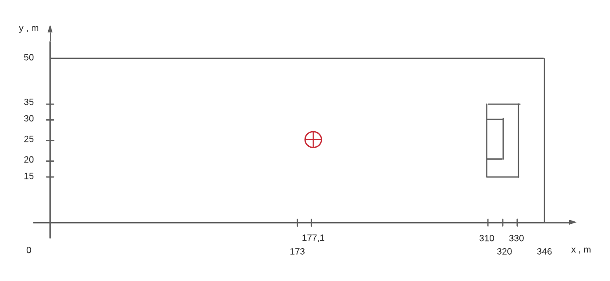

    * Side View: 

Now, for each Vessel, the center of mass was calculated:

The remaining US contents can be found on the Final Report.