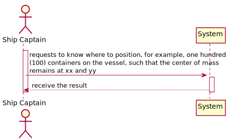

## US418 - As the Ship Captain I want to know where to position, for example, one hundred (100) containers on the vessel, such that the center of mass remains at xx and yy, determined in the previous point.
#### Acceptance Criteria [LAPR3]:

* Identify the area/volume of a container and its center of mass. The distribution of the mass inside the container will be considered uniform.
* Make a sketch of the distribution and loading on the vessel.
* Calculate the center of mass of the sketch performed.

## *Requirements Engineering*
#### SSD - System Sequence Diagram

#### DM - Domain Model

#### CD - Class Diagram

#### SD - Sequence Diagram

## US Logic

* Container distribution:

The remaining US contents can be found on the Final Report.