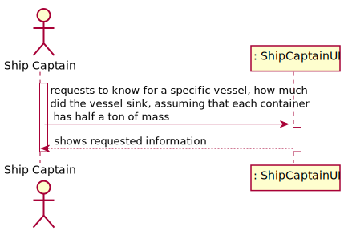
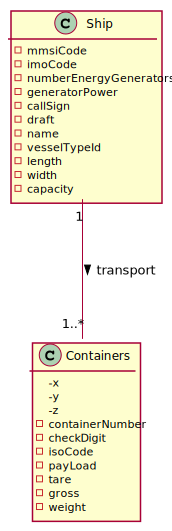
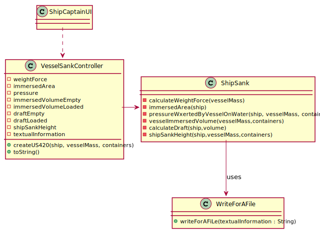
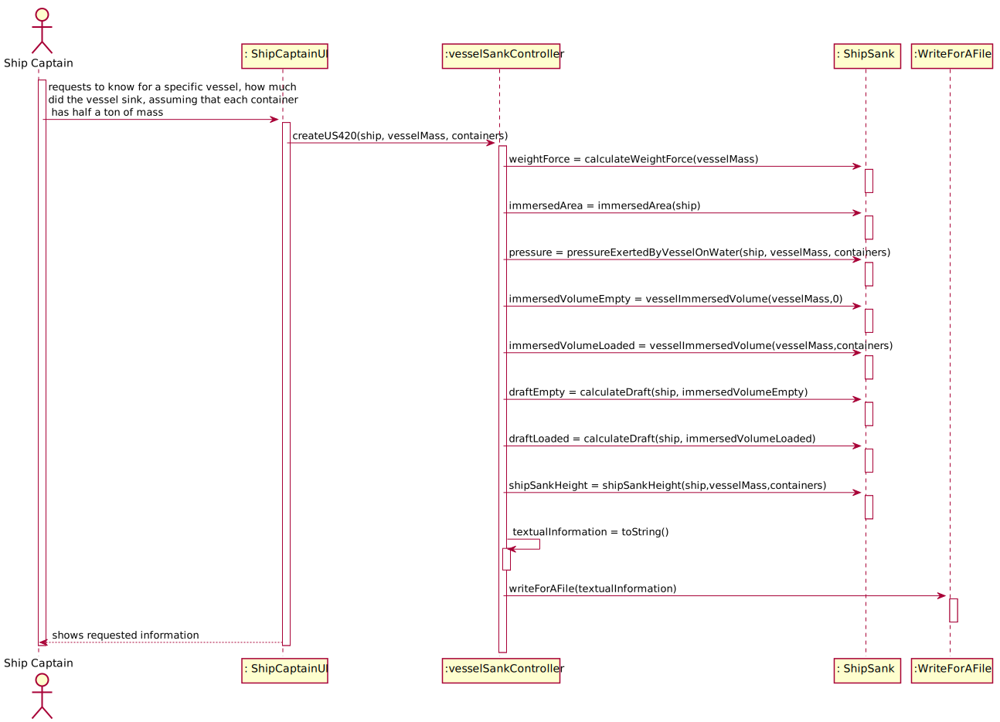
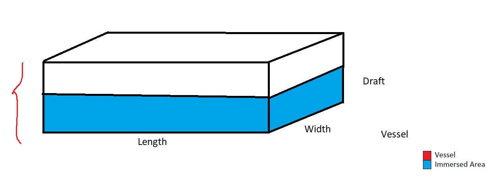

## US420 - As the Ship Captain I want to know for a specific vessel, how much did the vessel sink, assuming that each container has half a ton of mass.
#### Acceptance Criteria [LAPR3]:
* Determine the total mass placed on the vessel and the pressure exerted by it on the water.
* Determine the difference in height that the vessel has suffered, above water level.

## *Requirements Engineering*
#### SSD - System Sequence Diagram

#### DM - Domain Model

#### CD - Class Diagram

#### SD - Sequence Diagram

## US Logic

###### Since we are working with a vessel that sails through the waters of the sea, and the [densidade](https://www.todamateria.com.br/densidade-da-agua/) of sea water varies between 1.017 and 1.030 g/cm3, in the calculations we performed, opting for the value of 1030 kg/m3.

###### As we are working on a specific vessel, we ask the user to enter the vessel's characteristics. The available ships are the following, worked on US417: 
* *Reefer Vessel* - VesselMassUnloaded=152*10^6KG - length=342m - Width=42m 
* *Container Ship* - VesselMassUnloaded=140*10^6KG - length=352m - Width=46m
* *Lake Freighter* - VesselMassUnloaded=147*10^6KG - length=346m - Width=30m 

###### For the sake of explanation, we used the first one.

#### Determine the total mass placed on the vessel and the pressure exerted by it on the water

###### The formula for calculating pressure is as follows: P = F/A

###### Calculation of weight force (F): We consider the applied force the weight. That way:
* F = Weight = (Ship's Mass + Container's Mass) * Gravity = 1.48*10^9N

###### Calculation of the immersed area (A)

###### The A in the function, will correspond to the submerged area of the Ship, since we consider the ship to be a parallelepiped, the total area corresponds to the sum of the partial areas.

* A = (2 * width * draft) + (2 * length * draft) + (length * width) = 15433m

###### Calculation of the pressure that the ship exerts in the water (P):
* P = ((1.48*10^9)/15433) = 96518 Pa

#### Determine the difference in height that the vessel has suffered, above water level.

###### At first we will find out the volume of the empty ship immersed in the water, the formula to calculate it is as follows:
* Immersed volume (Ship Empty) = Ship's Mass / Density of salt water = 1.52*10^8/1030 = 147572 m^3
* Immersed volume (Ship Loaded) = Ship's Mass / Density of salt water = (1.52 * 10^8 + 20000 * 500)/1030 = 157282 m^3

###### To calculate the Draft, once we have the submerged volume, having the length and width, we can find the draft, with the ship empty and loaded.
###### Note: The empty ship draft is an attribute, however we calculate it to confirm.
* Draft (Ship Empty) = Immersed volume (Ship Empty) / (Length * Width) = 147572/(342*42) = 10.27m
* Draft (Ship Loaded) = Immersed volume (Ship Loaded) / (Length * Width) = 157282/(342*42) = 10.94m

###### To calculate the height the Ship descended once loaded, it is equal to the loaded ship's draft minus the empty ship's draft
* Ship Sank Height = Draft(Ship Loaded) - Draft(Ship Empty) = 10.94 - 10.27 = 0.67m

###### Therefore, the ship when loaded with 20000 containers dropped 0.67m.